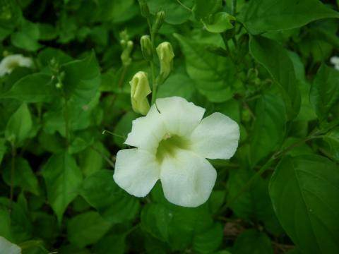
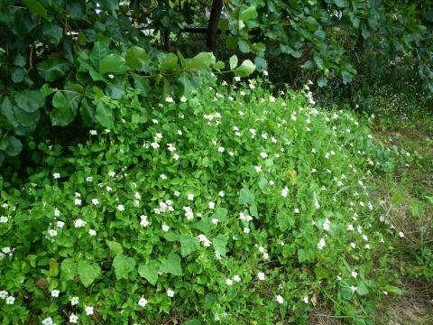

## Acanthaceae
# Asystasia gangetica subsp. micrantha
 **Plant Form** Mat-forming creeper. **Size** Usually 50 cm, but can scramble to 3 m height. **Stem** Sparsely hairy, develop roots where nodes contact soil. **Leaves** Bright green, paler underneath, **Flowers** Bell shaped, white to pinkish with two distinctive purple blotches on inside. **Fruit and Seeds** Up to 3 cm long, green then browning with age, explosively split in half and release 4 seeds per fruit. Hooked seed supports visible after they have split open. **Habitat** Neglected land, old gardens, fencelines, vacant blocks. **Distinguishing Features** Distinct but hard to distinguish from other subspecies.

 *Flower* 

 *Leaves* 

 *Forms clumps* 

