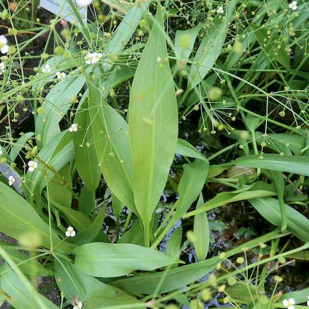
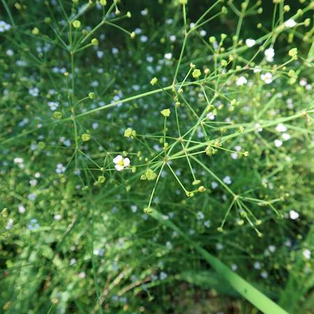

## Alismataceae
# Alisma lanceolatum
**common names:** alisma

**Plant Form** Emergent aquatic perennial. **Size** Up to 1.5 m tall. **Stem** Slender, loosely branched long flower stalks. **Leaves** Bright green, hairless, lance shaped, up to 25 cm long. **Flowers** Tiny pinkish, stalked, in groups of 2-5, 3 petals, almost circular. **Fruit and Seeds** 10-20 per flower with 1 seed each, flattened with short beak. **Habitat** Shallow water, drains, riverbanks, creeks. **Distinguishing Features** Narrower leaves than native water plantain, and leaves tapering to stalk.

   *Leaves spear-tip shaped* 

   *Flowers small and white* 

