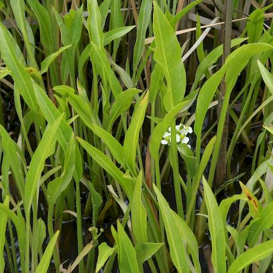

## Alismataceae
# Sagittaria platyphylla
 **Plant Form** Perennial aquatic herb. **Size** Up to 80cm tall above water. **Stem** Triangular. **Leaves** Submerged leaves are translucent and strap-like. Emerged leaves are usually lance-shaped up to 28 cm long but can be narrow and grass like if subject to disturbance. **Flowers** Whorled or coiled, 3 cm diameter with 3 white petals and a yellow centre. **Fruit and Seeds** In clusters with flattened and winged segments. 1 seed in each segment. **Habitat** Irrigation channels, drains, shallow creeks, wetlands. **Distinguishing Features** Similar to Alisma lanceolota but submerged leaves are different. Similar to other Sagittaria speces, but lance shaped leaves generally.

 *Flowers* 

 *Leaves* 

 *Habit* 

