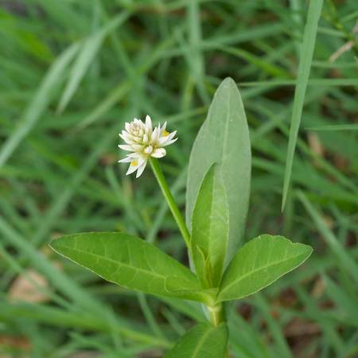

## Amaranthaceae
# Alternanthera philoxeroides
**common names:** alligator weed

**Plant Form** Creeping aquatic weed. **Size** Mats of up to 15 m. **Stem** Hollow, interwoven, creeping, up to 60 cm tall and 10 m long. **Leaves** Spear shaped without stalk, in opposite pairs. **Flowers** Small, white, papery 8-10 mm diameter on short stalks. **Fruit and Seeds** Reproduces vegetatively. **Habitat** Riparian areas and floodplains. **Distinguishing Features** Hollow stems, leaves in opposite pairs, small white flowers.

 *Leaves* 

 *Flowers on long stalk* 

 *Hollow stems* 

