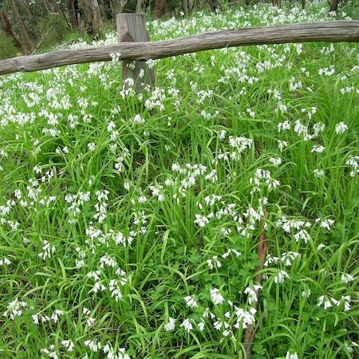
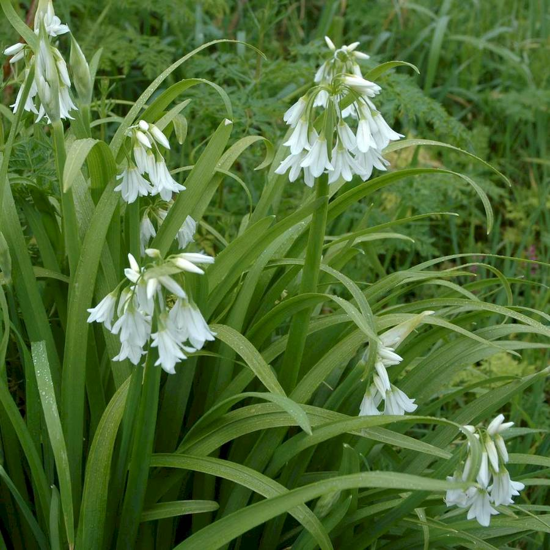

## Amaryllidaceae
# Allium triquetrum
**common names:** three cornered garlic

**Plant Form** Small perennial bulb herb. **Size** 18-50 cm tall. **Stem** Three-cornered, green and smooth, only flowering stems. **Leaves** Tuft of fleshy, flat, strap like blades from ground, grass like in appearance. **Flowers** Drooping, bell shaped, white, cluster on top of stem, with green midpetal ribs inside. **Fruit and Seeds** In white papery bracts, green capsules in clusters with black oblong seeds. **Habitat** Woodland, roadsides, old gardens, parks, riverbanks. **Distinguishing Features** Three-cornered stem is distinctive, and strong garlic smell.

  
 *Dense growth (RG FJ Richardson)* 

  
 *Plant (RG FJ Richardson)* 

