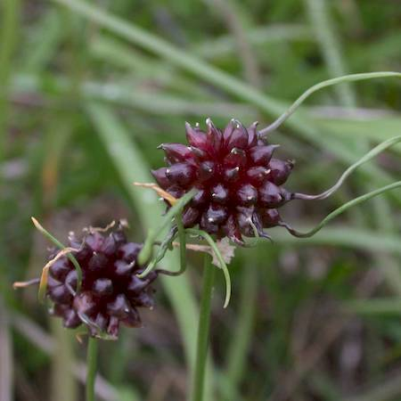
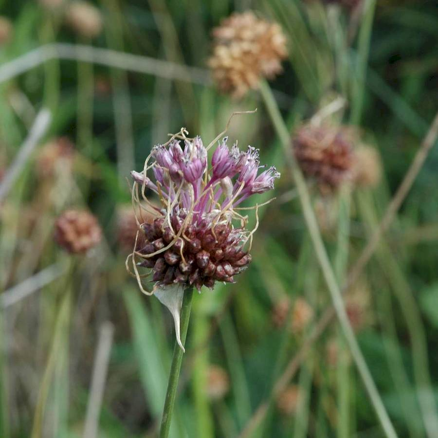
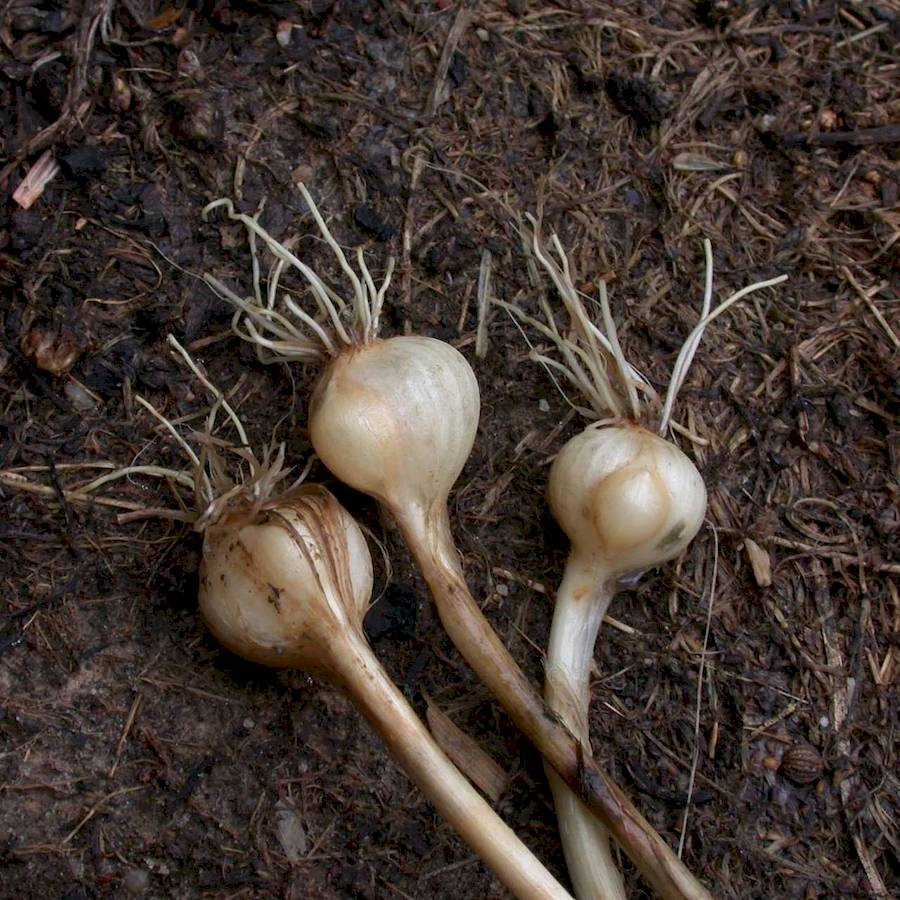
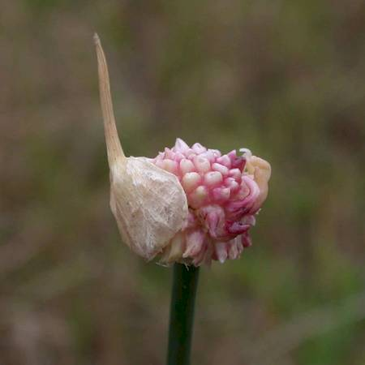

## Amaryllidaceae
# Allium vineale
**common names:** field garlic

**Plant Form** Erect perennial bulb herb. **Size** Up to 1.2 m tall. **Stem** Erect, hollow, cylindrical. **Leaves** 2-4 leaves from bulb 15-60 cm long, narrow, with grooves developing on upper surface with age. **Flowers** Green and white to pink, in heads. Rarely produced as egg shaped bulblets (up to 300 per head) are more often produced. **Fruit and Seeds** Black seeds in small capsules. **Habitat** Pastures, riverbanks. **Distinguishing Features** Relatively distinct.

 *Pods* 

 *Flowers* 

 *Bulbs* 

 *Buds* 

