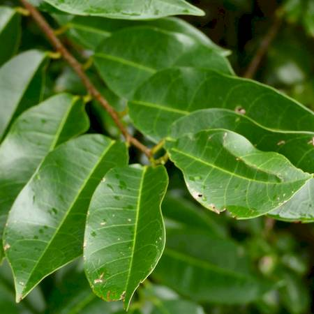

## Annonaceae
# Annona glabra
**common names:** pond apple

**Plant Form** Small tree. **Size** 3 to 15 m tall. **Stem** Swollen base of trunk becomes buttressed with age. **Leaves** Fresh leaves are glossy, becoming dull with age, paler underneath with red centre. **Flowers** Pale yellow or cream 2-6 cm across, with 3 large leathery petals. **Fruit and Seeds** Very large 5-15 cm green to yellow, then turning black as it decays. Containing more than 100 seeds. **Habitat** Freshwater swamps, estuaries, creeks and rivers, rainforest margins. **Distinguishing Features** Flowers and fruit distinguish from native mangroves. Smooth fruit distinguish from other naturalised Annona species.

 *Fluted trunk* 

 *Large fruit, yellowish when mature* 

 *Alternate leaves* 

 *Fruit have orange flesh* 

