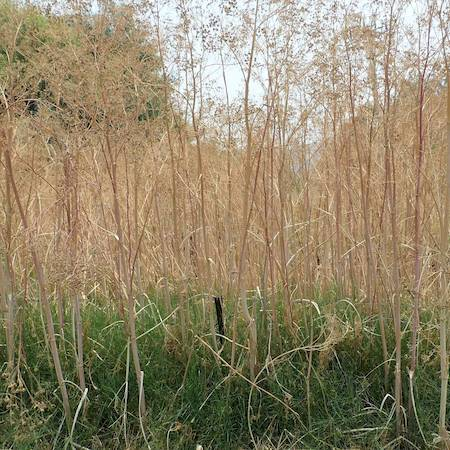

## Apiaceae
# Conium maculatum
**common names:** Hemlock

**Plant Form** Upright annual herb. **Size** 1-2m tall.

   *Foliage* 

   *Flowers in umbels* 

   *Leaf is finely divided* 

   *Flowers* 

   *Flowers are above leaves* 

   *Dies down in winter* 

