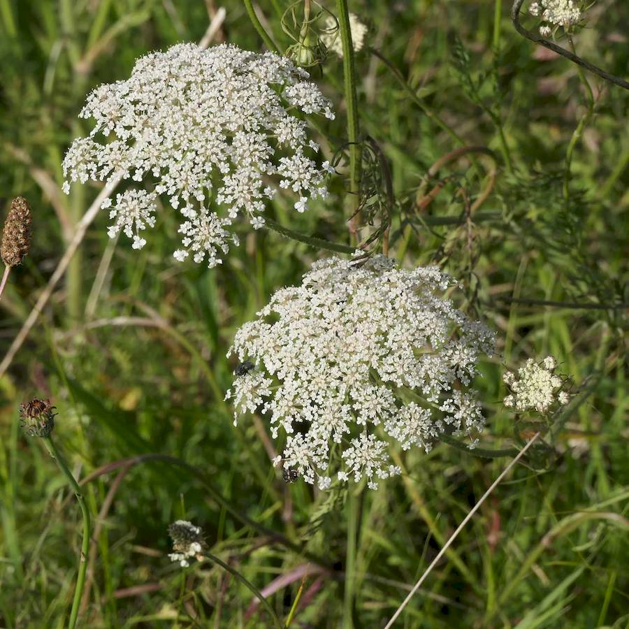
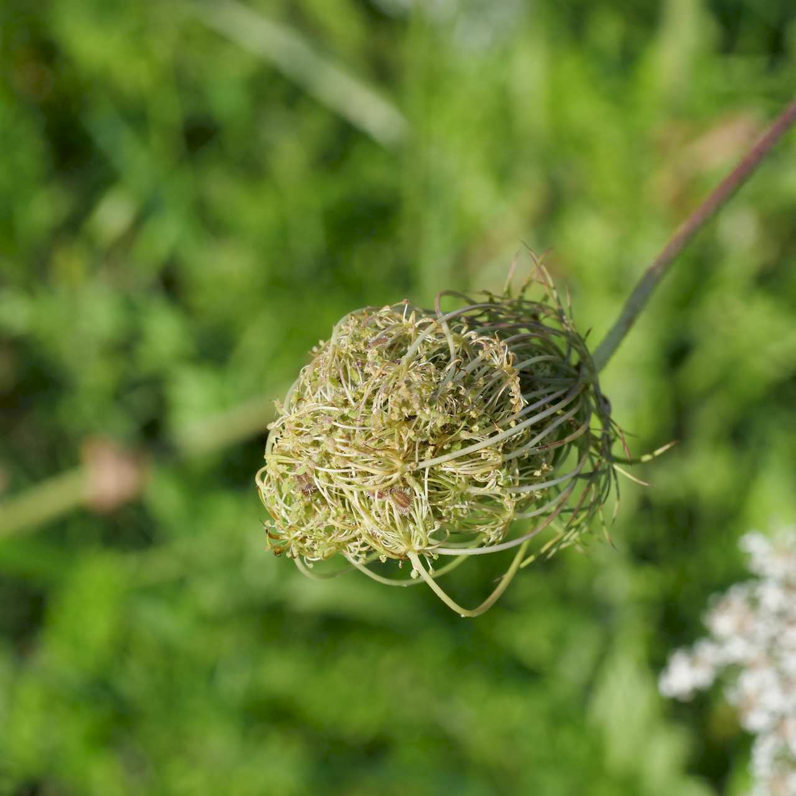
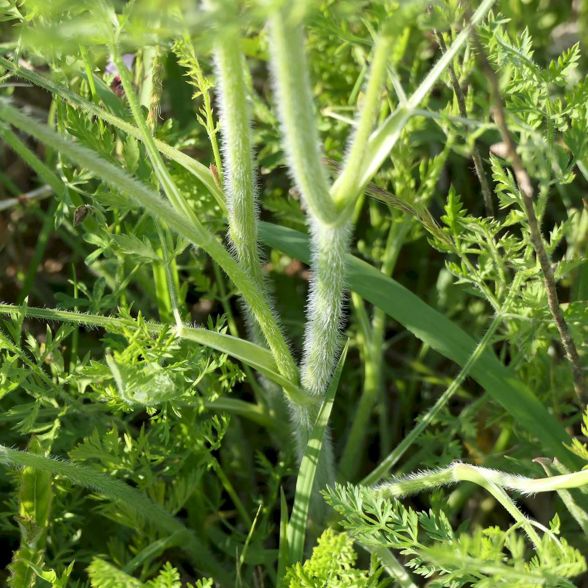
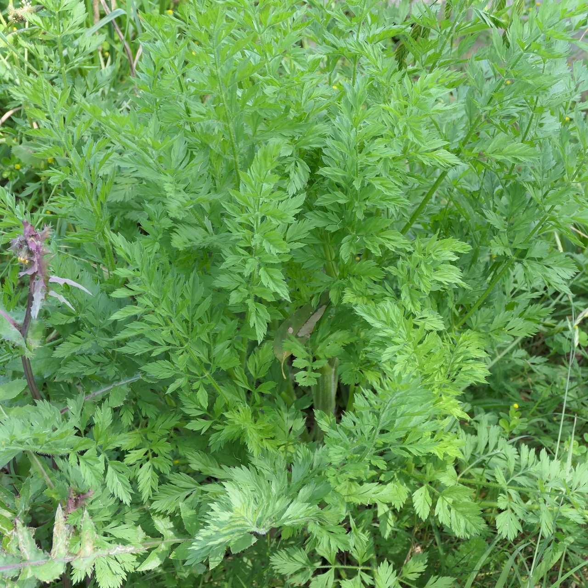

## Apiaceae
# Daucus carota
 **Plant Form** Erect biennial herb. **Size** 30-150cm tall. **Stem** Ridged lengthwise, covered in short rigid hairs, occasionally hairless. **Leaves** Up to 28 cm long in rosette, with a few alternating up stem, deeply divided with fern like appearance. **Flowers** Many small flowers arranged in tight compounds 5-15 cm wide, wide branching, white to yellowish pink. **Fruit and Seeds** Tiny 2-4 mm fruit covered in short spines. **Habitat** Disturbed areas, roadsites, pastures, old gardens. **Distinguishing Features** Larger than native carrots. Easy to differentiate from Hemlock by carrot smell and overall appearance.

 *Flower heads* 

 *Old heads roll into a ball* 

 *Hairy stem* 

 *Foliage* 

