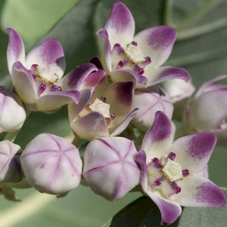
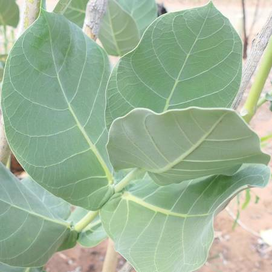
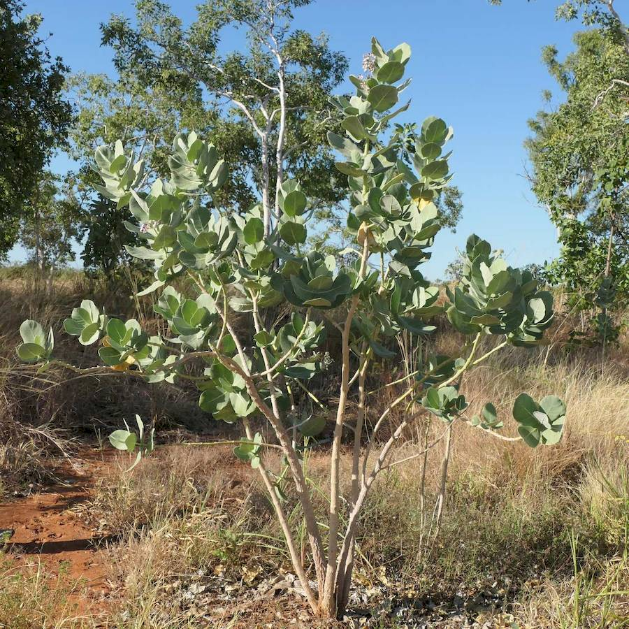
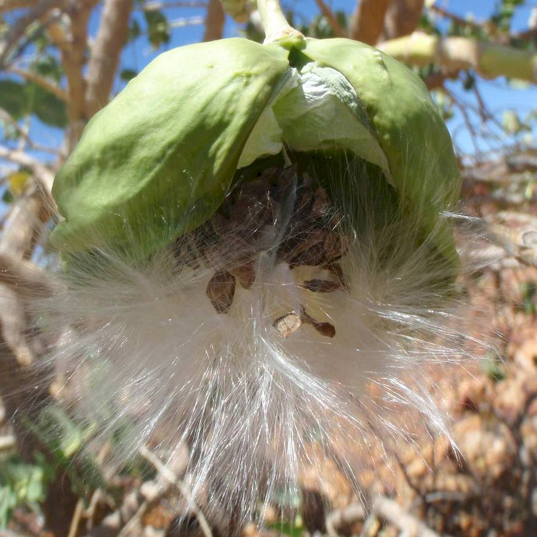

## Apocynaceae
# Calotropis procera
 **Plant Form** Large upright shrub or small tree. **Size** 1-4 m tall. **Stem** Green and smooth with milky sap, turning corrugated and corky beige with age. **Leaves** In opposite pairs 10-20 cm long, elliptical with heart shaped base, underside has hairs on midvein. **Flowers** Purple and white with 5 petals, waxy, in groups of up to 15. **Fruit and Seeds** Inflated pod 8-12 cm long, arranged in opposite pairs, rounded base with pointed tip, seeds have parachuting hairs. **Habitat** Cleared areas, roadsides, grazing land, savanna. **Distinguishing Features** Very distinctive without lookalikes.

 *Flowers* 

 *Leaves* 

 *Growth habit* 

 *Seed pod and seeds* 

