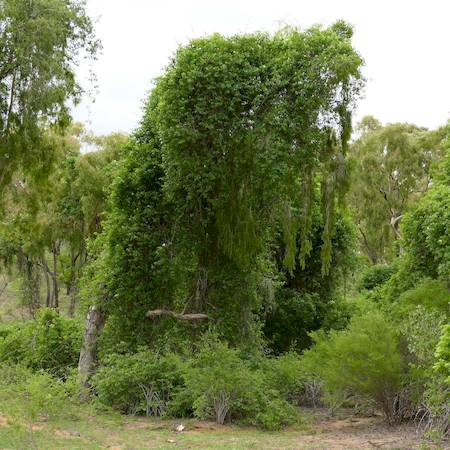

## Apocynaceae
# Cryptostegia grandiflora
**common names:** rubber vine

**Plant Form** Woody shrub or multi-branched climber. **Size** Up to 3 m tall, but much higher when climbing. **Stem** Greyish-brown with warty spots and milky sap. Long unbranched when climbing. **Leaves** Thick, leathery dark green and glossy top with duller undersides, 3-10 cm long on reddish purble stalks. **Flowers** Purplish pink to whitish, large showy and funnel shaped 4-6 cm long. **Fruit and Seeds** Pod-like in opposite pairs, greenish or brownish and 10-15 cm long, containing 200-450 seeds. **Habitat** Creek banks, forests, woodlands, grasslands, roadsides, waste areas. **Distinguishing Features** Flowers and fruit distinguish from Cryptostegia madagascariensis.

 *Flowers and leaves* 

 *Flower* 

 *Stems* 

 *Tree being smoothered* 

 *Vine defoliated by rust* 

