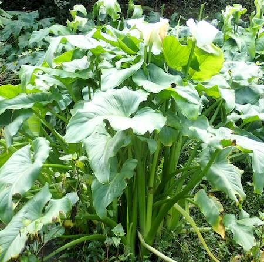
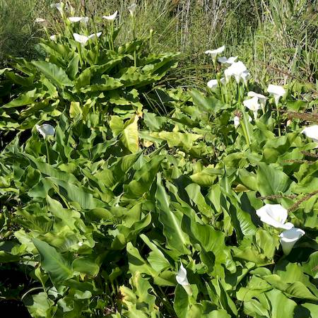

## Araceae
# Zantedeschia aethiopica
**common names:** arum lily

**Plant Form** Perennial clump-forming herb. **Size** Up to 1.5 m tall. **Stem** Thick green fleshy and sappy stalks 80 cm long, winged at base. **Leaves** Large, arrowhead shaped, glossy, dark green, up to 60 cm long. **Flowers** Typical arum, central yellow spike (spadix) surrounded by large white leaf-like petal (spathe) up to 25 cm long. **Fruit and Seeds** Irregular globular berries, 5-10 mm wide, in clusters at base of central spike. Containing several to many small yellowish brown seeds. **Habitat** Marshy areas, wasteland, rubbish dumps, wetlands, creeklines. **Distinguishing Features** With flowers it can be distinguished from Italian Arum by its larger size. Without flowers it might be hard to distinguish from several other cultivated plants.

   *Flower* 

   *Plant* 

   *Fruit (RG FJ Richardson)* 

   *Leaves* 

   *Infestation in drain* 

