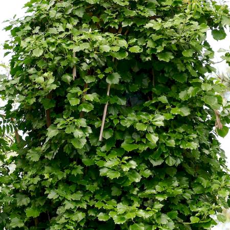

## Araliaceae
# Hedera helix
 **Plant Form** Climbing or creeping vine. **Size** Climbs up to 30m high. **Stem** Wiry, green to brown, sometimes thicker stems woody with age. **Leaves** Highly variable 3-5 lobed dark green waxy leaves. **Flowers** Umbrella-like clusters of small greenish-white flowers. Often absent unless sufficient sun. **Fruit and Seeds** Berry like purplish to black with fleshy outer covering. Containing one to several stone like seeds. **Habitat** Forests, rainforest, gullies, neglected land. **Distinguishing Features** Almost impossible and mostly redundant to distinguish from other ivy species and horticultural varieties.

 *Grows on ground and on tree trunks* 

 *Lower leaves are star-shaped* 

 *Upper leaves are rounded* 

 *Flowers are in heads* 

