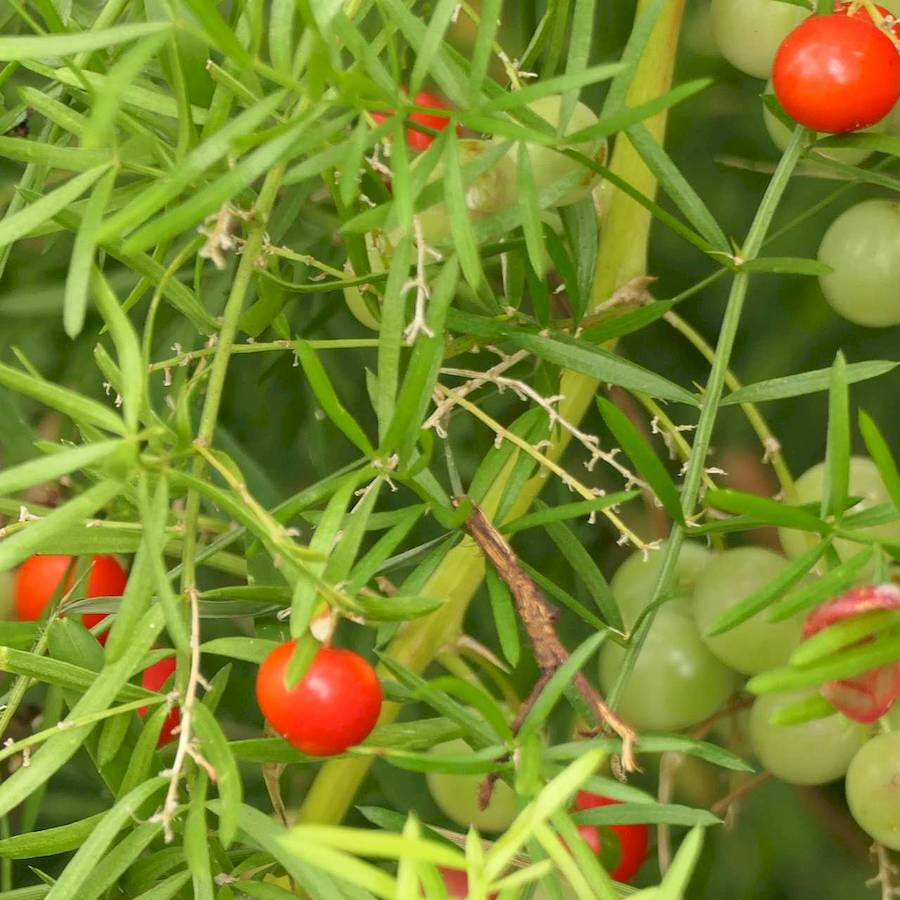
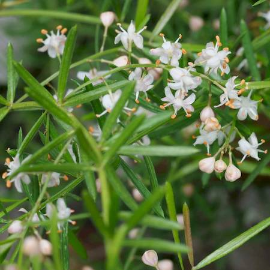
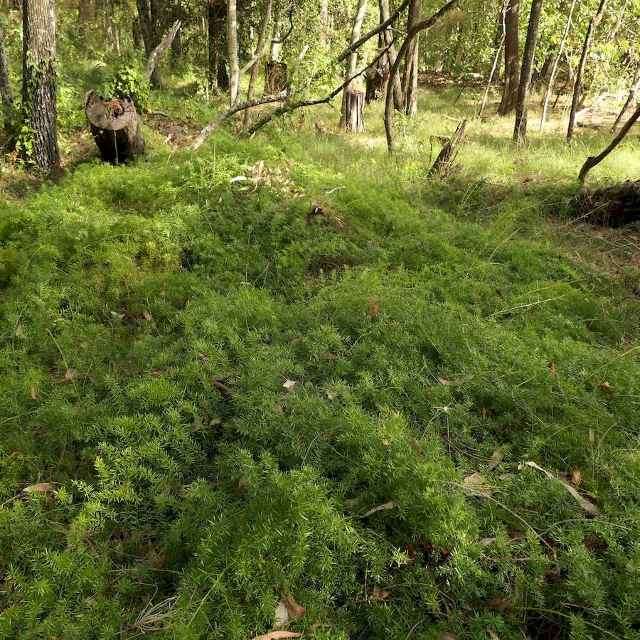
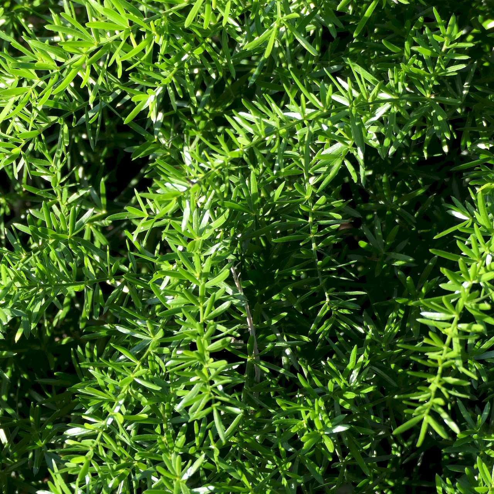

## Asparagaceae
# Asparagus aethiopicus
**common names:** ground asparagus

**Plant Form** Speading herb. **Size** Up to 2 m long. **Stem** Green to brown, rounded with ridges, spines 5-10 mm long. **Leaves** Slender pointed flattened stems function as leaves, 15-25 mm long, and in clusters of 1-5. **Flowers** White to pale pink about 5 mm diameter in clusters of 4-8. **Fruit and Seeds** Berry, green to glossy red, 5-8 mm wide, with either 1 or few seeds. **Habitat** Urban fringes, degraded land to native vegetation, in partial or full shade. **Distinguishing Features** Combination of features distinguish from other asparagus ferns.

  
 *Leaves and berries* 

  
 *Flowers* 

  
 *Forms dense cover over ground* 

  
 *Leaves small and surround stems* 

