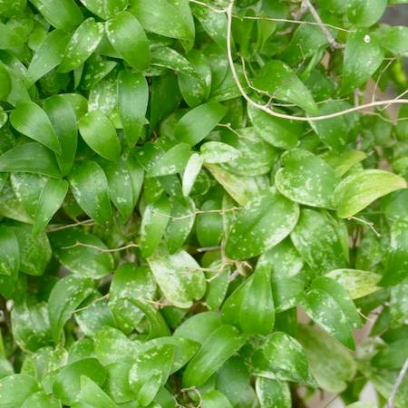

## Asparagaceae
# Asparagus asparagoides
 **Plant Form** Climbing herb. **Size** Up to 3 m tall. **Stem** Wiry, green, branching frequently, flattened sterms form psuedo leaves. **Leaves** Reduced, scale-like, their function replaced by flattened stems 5-15 mm long, curved and oval-shaped. **Flowers** White, solitary or few per cluster, stalked 3-8 mm with 6 petals. **Fruit and Seeds** Red, spherical berry, 5-19 mm diameter. **Habitat** Open coastal woodland, also orchards and roadsides. **Distinguishing Features** Leaves can have similar appearance to native Wombat Berry, but flowers and fruit are distinctive.

 *Large and broad leaves* 

 *Leaves yellow for winter, red berries* 

 *Forms curtains of foliage on tree trunks* 

