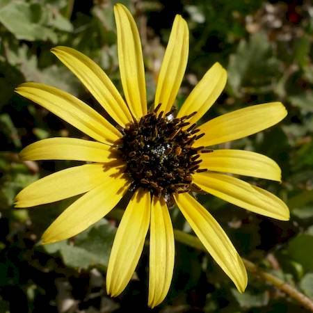

## Asteraceae
# Arctotheca calendula
**common names:** Cape Weed

**Plant Form** Annual rosette herb. **Size** Up to 30 cm tall. **Stem** Purplish, sprawling, flowering stems have white hairs. **Leaves** Mostly in rosette, lobed, 5-25 cm long and 2-6 cm wide, margins toothed, upper surface naked or hairy, lower surface white-felted. **Flowers** Round, 15 mm diameter, with yellow petals 1.5-2.5 cm long and dark centre. **Fruit and Seeds** 2 mm long, covered with brown wool. **Habitat** Lawns and gardens. **Distinguishing Features** Lobed leaves with white-felted underside.

 *Flower* 

 *Flowers* 

 *Flower carpet* 

 *Small plant* 

 *Late season foliage* 

