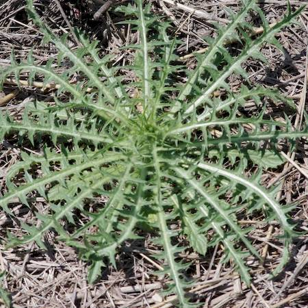

## Asteraceae
# Carthamus lanatus
**common names:** saffron thistle

**Plant Form** Erect annual herb **Size** Up to 100 cm tall. **Stem** Yellowish white or pale green, rigid and ribbed. **Leaves** Dissected, spiny, 30-60 mm long. **Flowers** Yellow, 10-20 mm diameter, with outer leaf-like bracts, often bent downwards, cobwebby, spiny. **Fruit and Seeds** 5-6 mm long, smooth, naked, light brown, with pappus (parachuting hairs) of many linear scales 7-10 mm long. **Habitat** Paddocks, disturbed areas, generally open. **Distinguishing Features** Combination of yellow flowers and leaf lobes ending in spines.

   *Thin yellow flowers* 

   *Leaves thin and spiny* 

   *Early growth is flat* 

   *Later growth is upright* 

