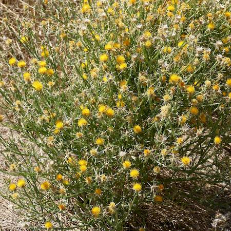

## Asteraceae
# Centaurea solstitialis
**common names:** St Barnaby's thistle

**Plant Form** Annual or biennial herb. **Size** Up to 1m tall.

  
 *Flowers* 

  
 *Spindly growth* 

  
 *Forms low bushes* 

