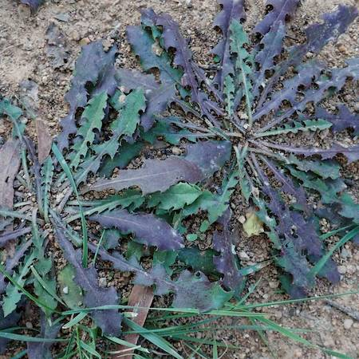
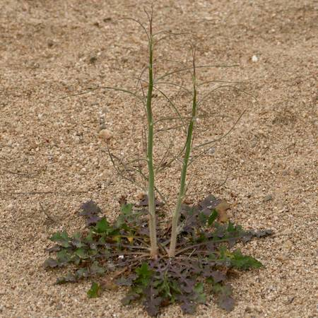
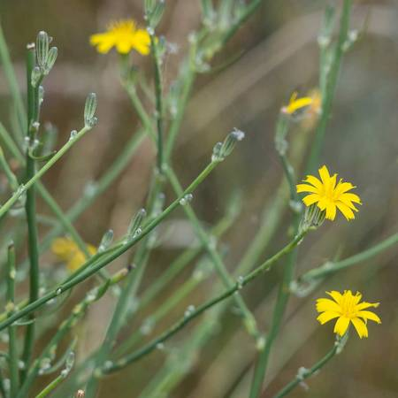

## Asteraceae
# Chondrilla juncea
**common names:** skeleton weed

**Plant Form** Perennial herb **Size** Up to 1 m tall. **Stem** Wiry, almost leafless. **Leaves** Lower part dissected, up to 40-200 x 15-50 mm, but soon disappearing; stem leaves few, small and reduced. **Flowers** Yellow, of dandelion type with small tongue-shaped florets, in groups of 1-3, 3-4 mm diameter. **Fruit and Seeds** 8-10 mm long, naked, with parachuting hairs 6-7 mm long. **Habitat** Arid and semi-arid open scrubland and cropping land. **Distinguishing Features** Wiry, bare stems and dissected rosette on ground.

 *Rosette plant when small* 

 *Grows central flower spike* 

 *Yellow flowers on spindly branches* 

 *Leaves present in wet years* 

