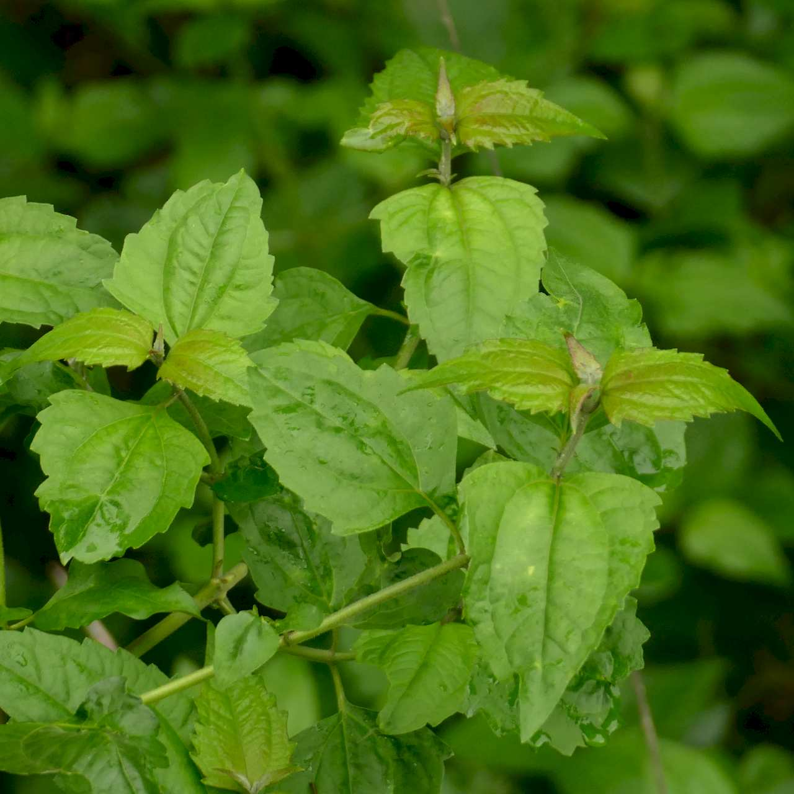
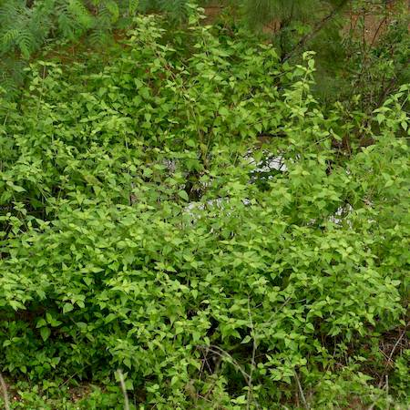
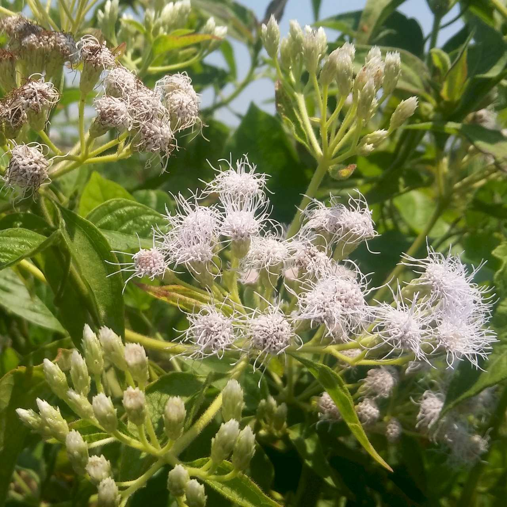

## Asteraceae
# Chromolaena odorata
**common names:** Siam weed

**Plant Form** Upright thicket forming shrub **Size** 1.5 to 3m tall. Taller when climbing. **Stem** Smooth, round, brittle, woody at base of trunk with age. **Leaves** Soft, green, hairy, triangular, with 3 prominent veins. **Flowers** Clusters of 10-35 pale pink or white tubular flowers with tassel like protruberances. **Fruit and Seeds** Brown to black 5 mm long with parachuting hairs and barbs. **Habitat** Riverbanks, rainforest, waste areas, granite slopes, coastal areas. **Distinguishing Features** May look like Billy goat weed while young but when mature growth habit is similar to Lantana but visually distinct.

  
 *Leaves* 

  
 *Infestation on a creek* 

  
 *Flowers* 

