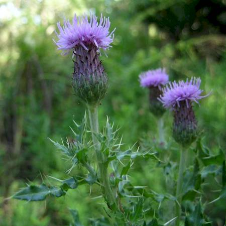

## Asteraceae
# Cirsium arvense
**common names:** perennial thistle

**Plant Form** Perennial herb, spreading with rhizomes. **Size** Up to 100 cm tall. **Stem** Green, smooth, sometimes hairy, with white spines. **Leaves** Dark green above, white below, spiny, lobed, 1-7 cm long. **Flowers** Purple, narrow, in heads with 8-15 mm diameter bracts in several series, with short spines at tips, sometimes hairy or cobwebby. **Fruit and Seeds** 3 mm long, smooth, with parachuting hairs 20-25 mm long. **Habitat** Roadsides, pasture and cropping land. **Distinguishing Features** Flowerheads narrowly cylindric and in large clusters wide, solitary or in small clusters in Cirsium vulgare.

   *Flowers* 

   *Leaves* 

   *Seed* 

   *Foliage* 

