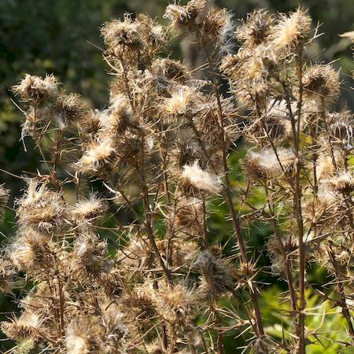

## Asteraceae
# Cirsium vulgare
 **Plant Form** Biennial erect herb. **Size** Up to 1.5 m tall. **Stem** Interrupted, spiny wings along stems. **Leaves** Toothed to lobed, with spiny margins, to 30 cm long, green above and white below. Stem leaves are 4–25 cm and stalkless, forming a wing. **Flowers** Purple, 12-40 mm diameter, with spreading to recurved spines. **Fruit and Seeds** 3-6 mm long, light brown, smooth, with parachuting hairs 2-3 cm long. **Habitat** Agricultural areas, wasteland, roadsides. **Distinguishing Features** Flowerheads wide, solitary or in small clusters versus narrowly cylindric in larger clusters in Cirsium arvense.

 *Flowers are large* 

 *Juveniles are woolly in winter* 

 *Juveniles green and flat if not cold* 

 *Can grow large* 

 *Fluffy seed on standing dead plants* 

