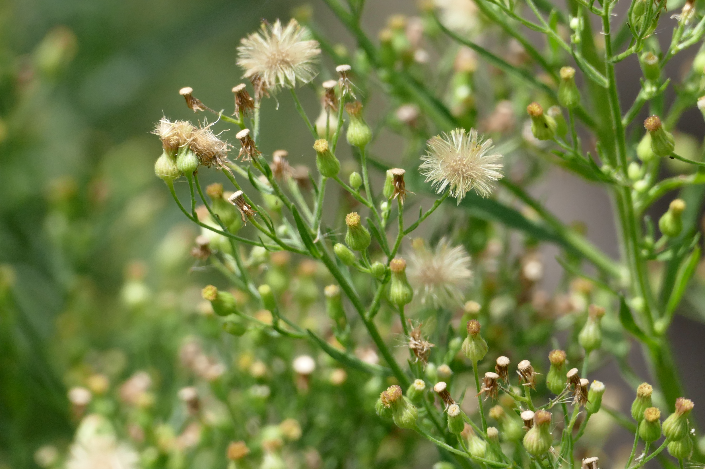
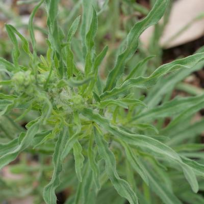
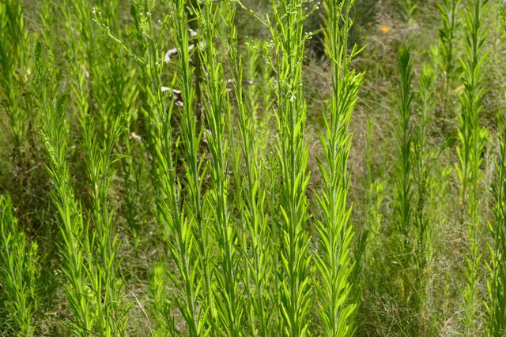
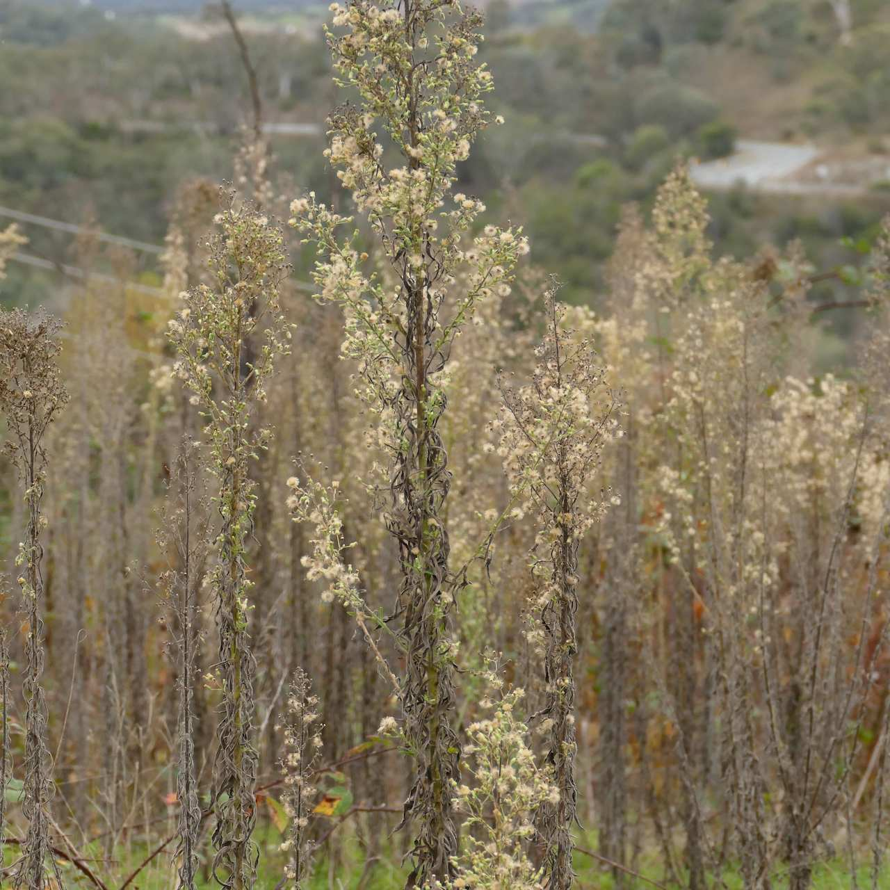

## Asteraceae
# Conyza bonariensis
**common names:** flaxleaf fleabane
**synonyms:** Conyza bonariensis

**Plant Form** Erect annual herb. **Size** Up to 1m tall.

   *Brown silk on seeds* 

   *Leaves are wriggly* 

   *Tall and erect* 

   *Dies in winter* 

