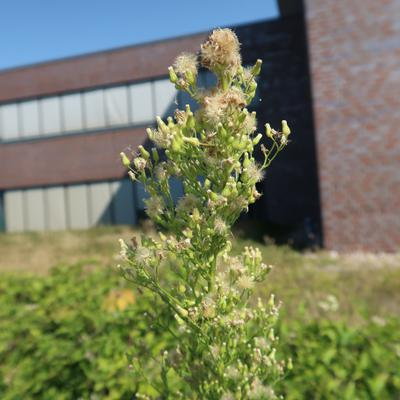
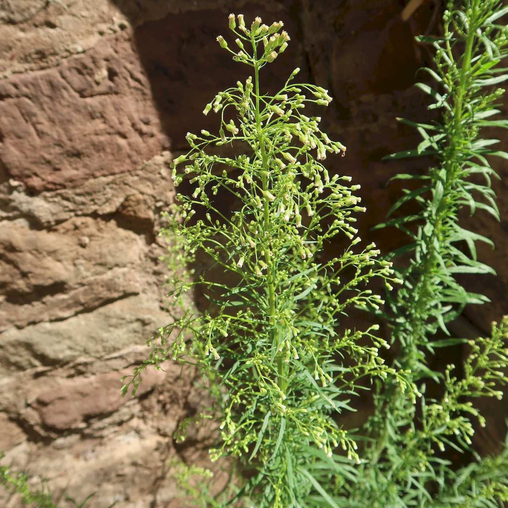

## Asteraceae
# Conyza canadensis
**common names:** Canadian fleabane
**synonyms:** Conyza canadensis

**Plant Form** Erect annual herb. **Size** Up to 1.5m tall.

  
 *Fluffy brown seed* 

  
 *Leaves green, fine* 

