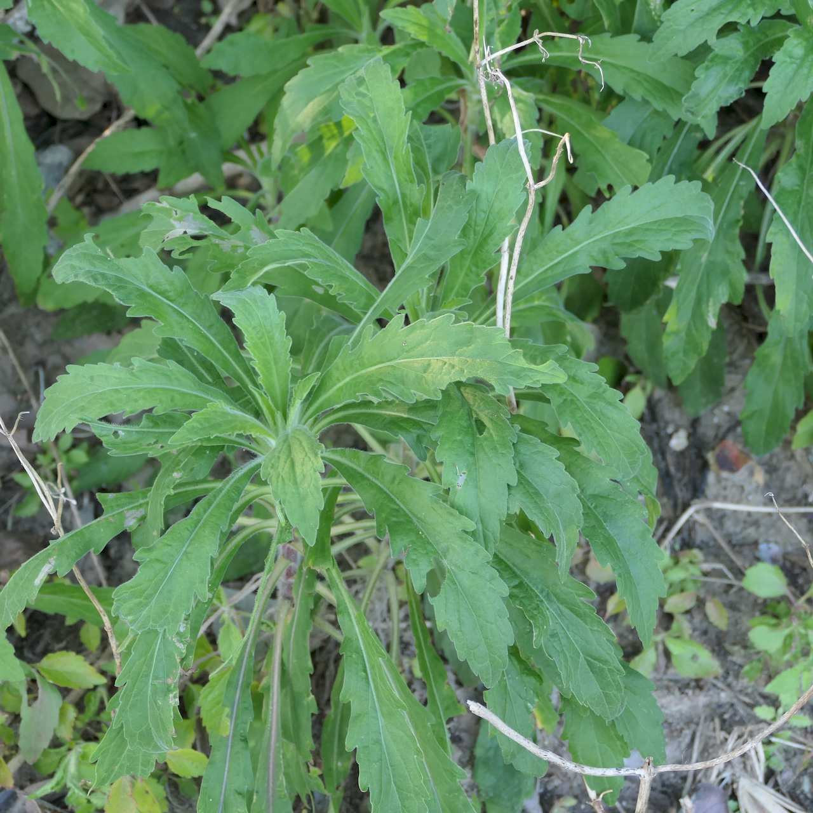
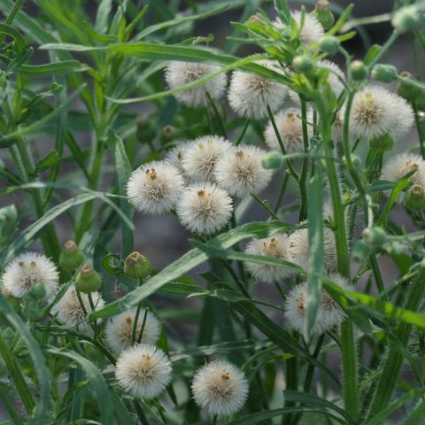

## Asteraceae
# Conyza sumatrensis
**common names:** tall fleabane
**synonyms:** Conyza sumatrensis

**Plant Form** Erect annual herb. **Size** Up to 2m tall.

  
 *Larger leaves* 

  
 *White silk on seeds* 

  
 *Can get tall* 

