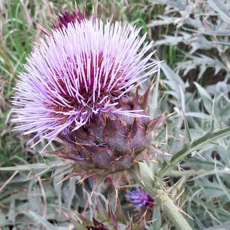
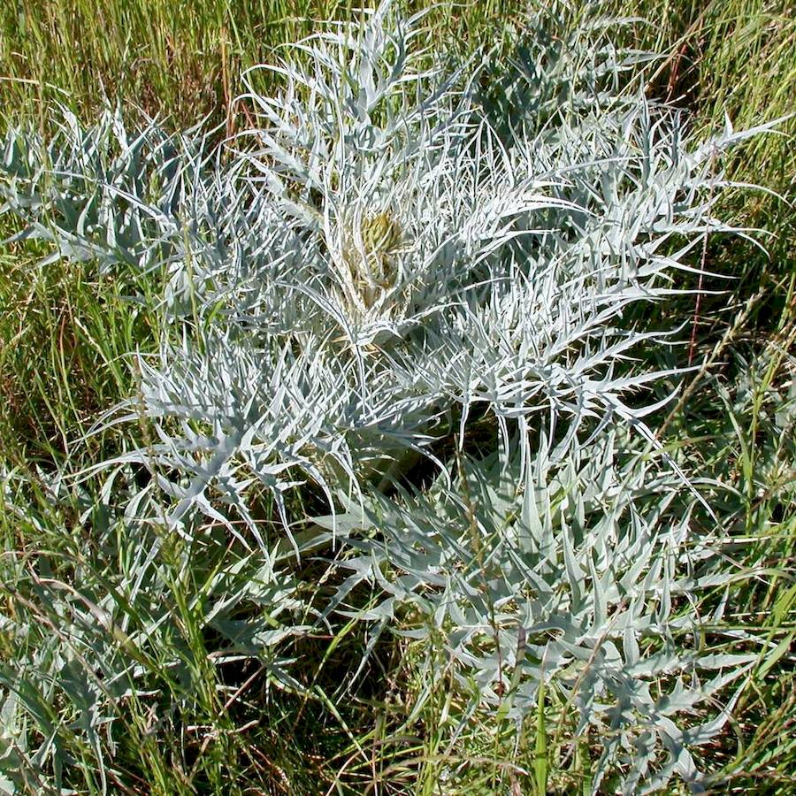
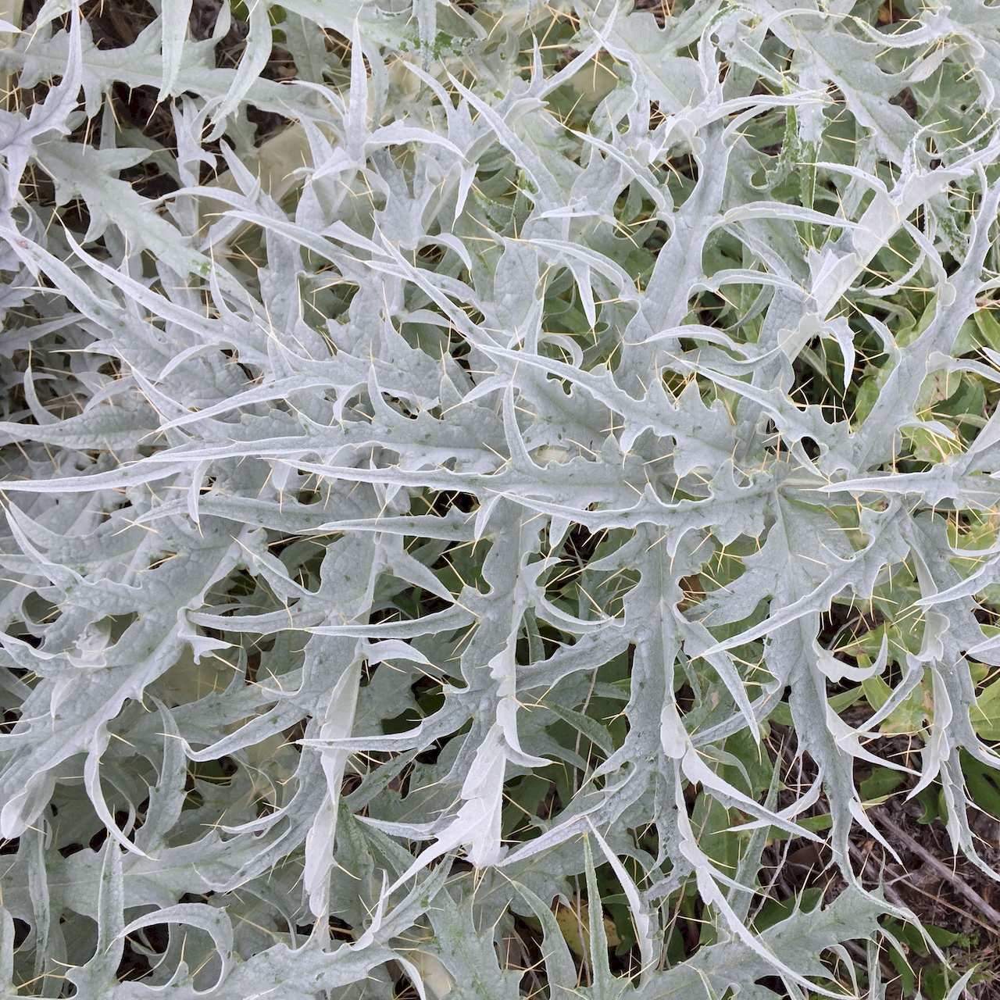
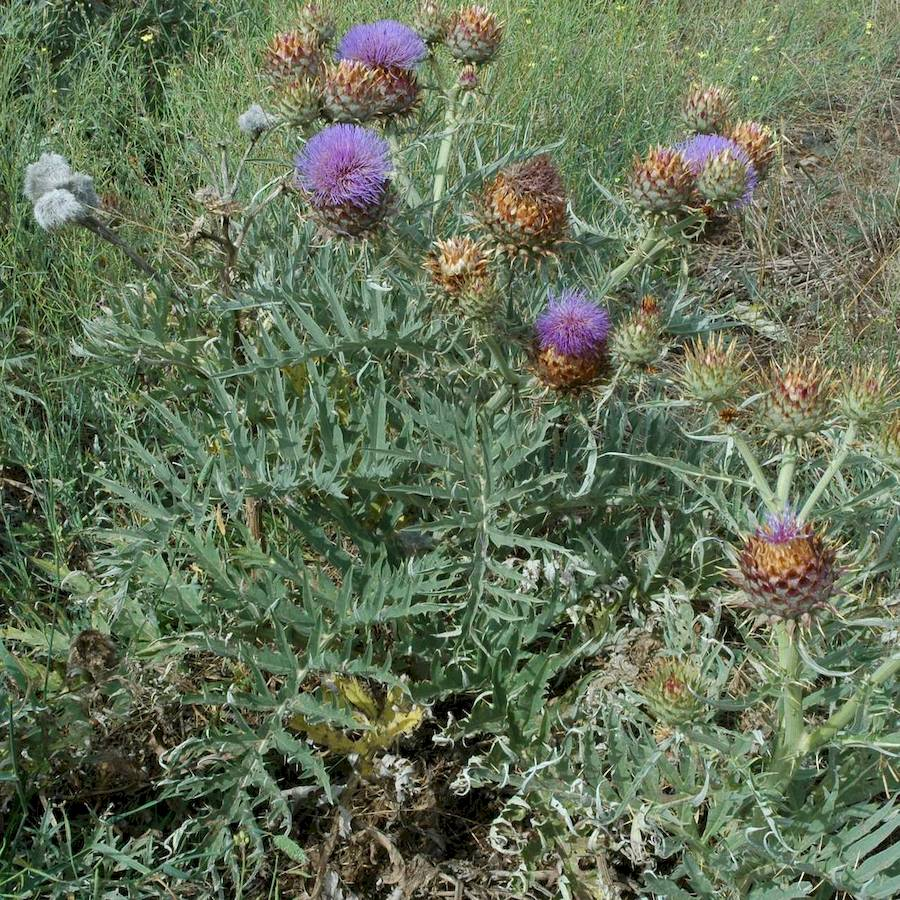

## Asteraceae
# Cynara cardunculus
 **Plant Form** Upright perennial rosette herb. **Size** Up to 2 m tall. **Stem** Single thick ribbed stem grows from rosette, covered in hairs, and branched higher up. **Leaves** Deeply divided, greyish green with wooly undersides and yellowish spines 0.5 to 2 cm long on tips and edges. **Flowers** Large single round flowers on tips of thick stalks, with a head of purple florets at peak flowering. **Fruit and Seeds** 6-8 mm long with large feathery hairs, which fall off. **Habitat** Pastures, grasslands, woodlands, roadsides and other disturbed areas. **Distinguishing Features** Artichoke flowerheads and leaf shape.

 *Flower head* 

 *Foliage* 

 *Leaf* 

 *Growth habit* 

