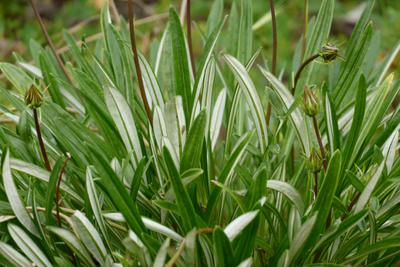
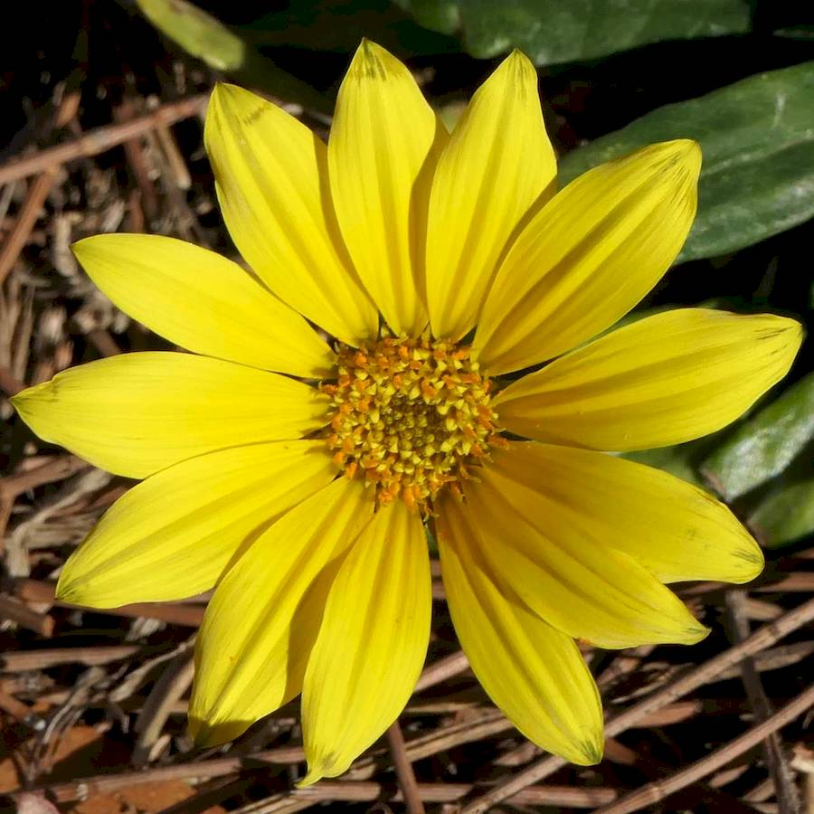
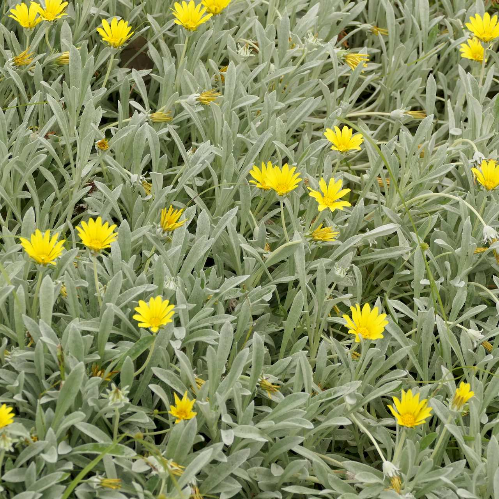

## Asteraceae
# Gazania
**common names:** gazania

**Plant Form** Tufted low-growing perennial herb. **Size** Up to 30 cm tall. **Stem** Flowering stems above rosette, narrow and occasionally reddish. **Leaves** Dark green glossy to silver/grey and hairy. Undersides distincly white. **Flowers** Brightly coloured daisy like flowers in a variety of colours, mainly yellow or orange, with indented central ribs on petals which is occasionally differently coloured or patterned. **Fruit and Seeds** Sometimes 60 or more seeds per flower, wind dispersed. **Habitat** Coastal dunes, roadsides, agricultural areas. **Distinguishing Features** Leaf undersides whitish. Flower petals with central indented ribs.

   *Leaves simple* 

   *Flowers mostly yellow* 

   *Has a grey-leaved variety* 

