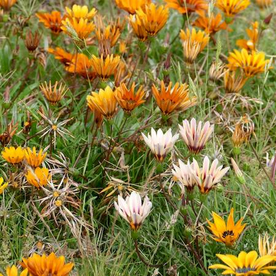
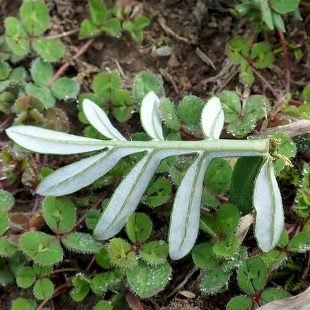

## Asteraceae
# Gazania linearis

**Plant Form** Tufted perennial herb. **Size** Up to 30cm tall.

   *Divided leaves* 

   *Flowers from white to red* 

   *Leaf undersurface white* 

   *Flower close-up* 

