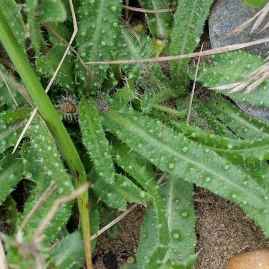

## Asteraceae
# Helminthotheca echioides

**Plant Form** Annual to perennial rosette herb. **Size** Up to 100cm tall.

  
 *Yellow flowers in spikey clusters* 

  
 *Leaves have stiff hairs* 

  
 *Leaves are rough* 

