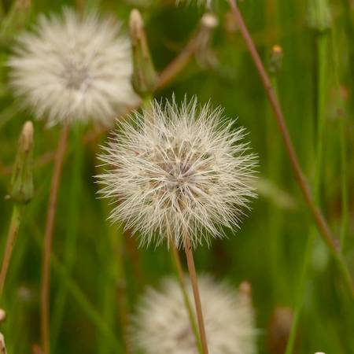

## Asteraceae
# Hypochaeris radicata
 **Plant Form** Perennial rosette herb. **Size** 15-80 cm tall. **Stem** Light green, slender, pithy, exudes a milky sap when cut. **Leaves** Lance shaped with irregular lobes or toothed edges. Generally in flat rosette. Usually very hairy. **Flowers** Solitary dandelion like, on long branched stems, round with many yellow straplike petals. **Fruit and Seeds** Orange-brown 4-7 mm long 1 seeded fruit with a long slender beak and in globular grouping with parachuiting hairs. **Habitat** Pastures, gardens, lawns, paddocks, roadsides, waste areas. **Distinguishing Features** More hairy leaves than Hypochaeris glabra, branched flower stalk compared to single in dandelion.

 *Typical plant* 

 *Yellow flowers on branching stalks* 

 *Seed heads* 

