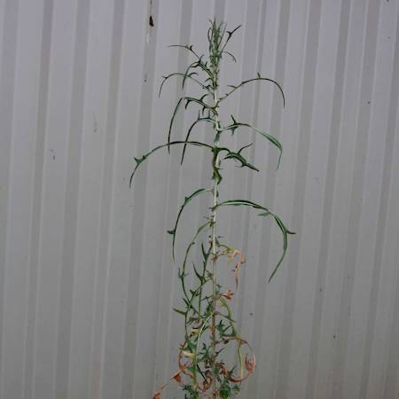

## Asteraceae
# Lactuca saligna
**common names:** prickly lettuce

**Plant Form** Annual or biennial erect herb. **Size** 30 cm to 1 m tall.

 *Fine leaves (Hanwen Wu)* 

 *Light yellow flowers (RCH Shepherd)* 

