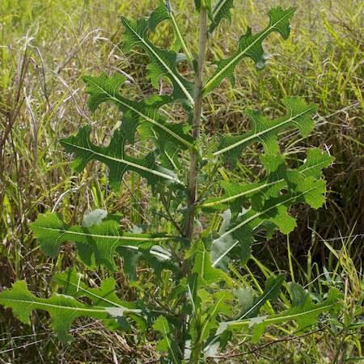
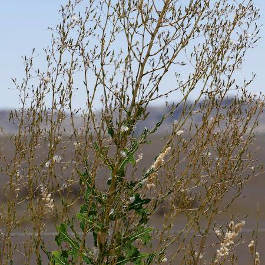
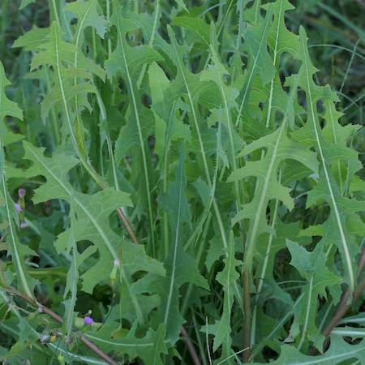

## Asteraceae
# Lactuca serriola
 **Plant Form** Biennial erect herb. **Size** 1 to 2 m tall. **Stem** Green to whitish, smooth and often with prickles near base. **Leaves** Oblong or lance shaped, become deeply lobed with age, with spiny white midrib. **Flowers** Pale yellow, about 20 overlapping strap-like petals with toothed ends, about 8 mm diameter. **Fruit and Seeds** Dandelion like with hairy parachutes. **Habitat** Abandoned fields, roadsides, urban areas, wasteland. **Distinguishing Features** Very similar to L.virosa but generally shorter and more prickly. Milky latex from cut stem stays more pale.

 *Midrib and stalk have soft spines* 

 *Leaves often in a flat plane* 

 *Big inflorescence held high* 

 *Yellow flowers* 

 *Lower leaves usually deeply lobed* 

 *Upper leaves usually smooth edged* 

