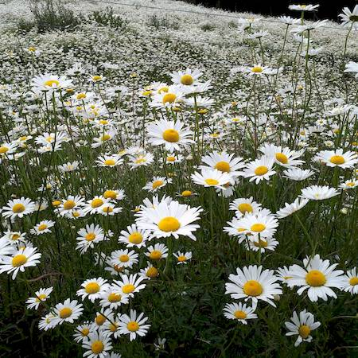
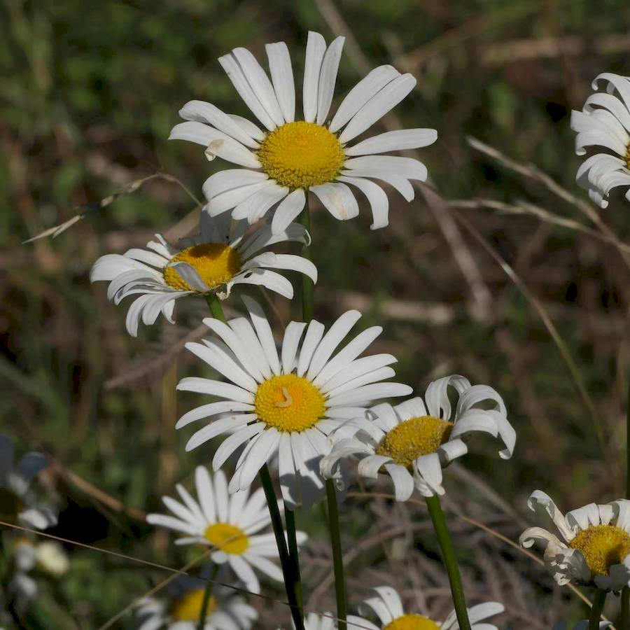
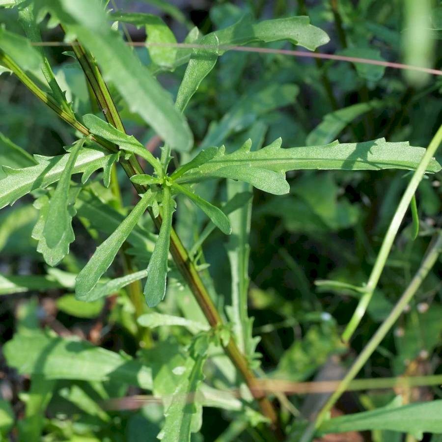

## Asteraceae
# Leucanthemum vulgare
**common names:** oxeye daisy

**Plant Form** Erect perennial rosette herb. **Size** Usually 30-60cm tall, occasionally up to 1m. **Stem** Long, narrow. **Leaves** Rosette leaves are larger, spoon shaped and with jagged edges, stem leaves are lance shaped, small and very jagged. **Flowers** Single 3-5 cm wide on long stem with yellow centre and white petals. **Fruit and Seeds** Very small 2-3 mm long, dark brown to black, cylindrical with tapered end. **Habitat** Disturbed areas, grasslands, alpine areas, wetlands, burnt areas. **Distinguishing Features** Smaller than Shasta Daisy, larger flowers and different leaves to Stinking Mayweed.

 *Infestation (Adam Muyt)* 

 *Flowers* 

 *Leaves and stem* 

