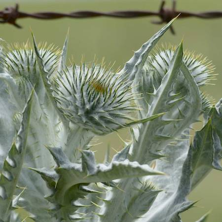
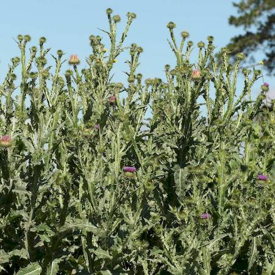
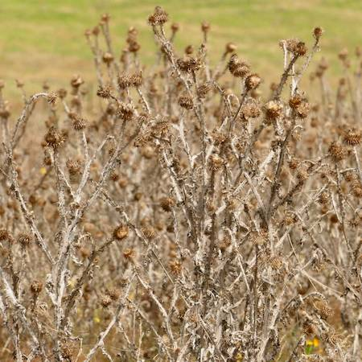

## Asteraceae
# Onopordum acanthium
**common names:** Scotch thistle

**Plant Form** Erect biennial herb. **Size** Up to 2 m tall. **Stem** Erect, with wings up to 1.5 cm wide, and spines to 5 mm long. Wooly or cobwebby appearance. **Leaves** Grey-green, spiny, egg shaped to lance shaped, up to 35 cm long. **Flowers** White to purple heads up to 6 cm diameter. **Fruit and Seeds** Brown-grey 4-5 mm long, ribbed with hairs on top. **Habitat** Pastures, irrigated and dryland cropping areas. **Distinguishing Features** Similar to other Onopordum species, but with a stem unlike Stemless thistle, and with deeper lobed leaves and more wooly stems than Illyrian thistle.

 *Big flowers, small drought leaves* 

 *Broad woolly leaves* 

 *Woolly all over* 

 *Tall thickets* 

 *Growth form* 

 *Standing remains* 

