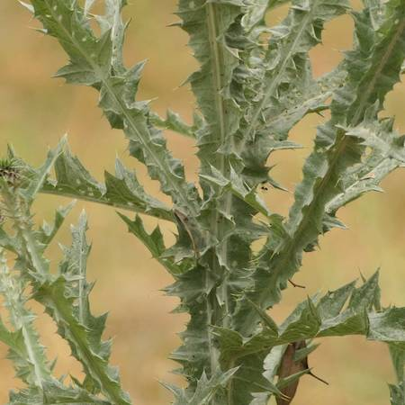
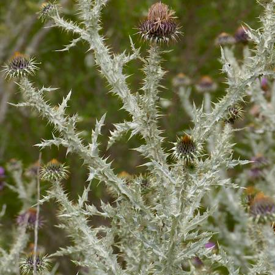
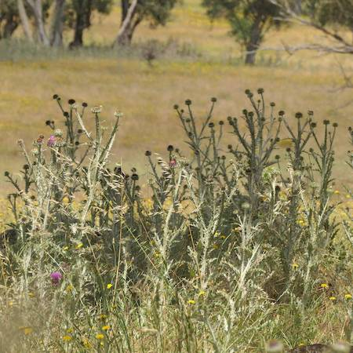

## Asteraceae
# Onopordum illyricum
**common names:** Illyrian thistle

**Plant Form** Erect annual or biennial herb. **Size** Up to 2 m tall. **Stem** Erect, with wings up to 1.5 cm wide, and spines to 5 mm long. Slightly wooly or cobwebby appearance. **Leaves** Grey-green, spiny, deeply lobed, lance shaped, up to 55 cm long. **Flowers** Purple heads up to 6 cm diameter, surrounded by spiny bracts. **Fruit and Seeds** Brown, 4-angled, wrinkled capsules. **Habitat** Pastures, irrigated and dryland cropping areas. **Distinguishing Features** Similar to Scotch thistle, but less cobwebby in appearance, and generally larger flowerheads. There are hybrids however.

  
 *Large flower, coloured spines* 

  
 *Dark buds* 

  
 *Winged stems* 

  
 *Small leaves, very spiny* 

  
 *Growth habit* 

