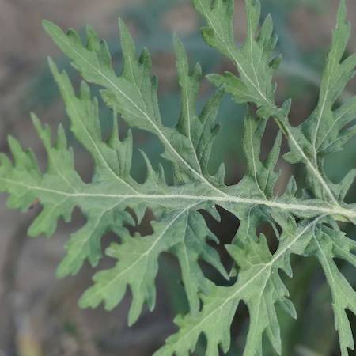
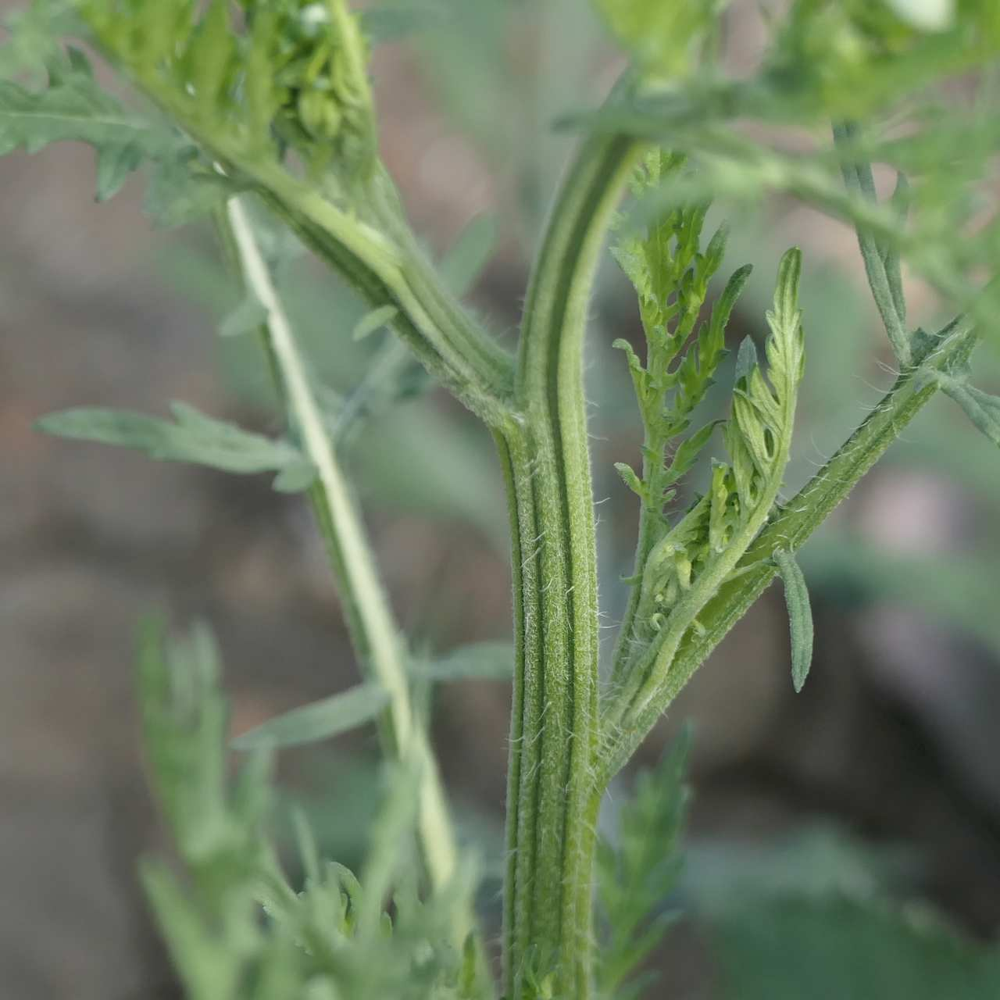
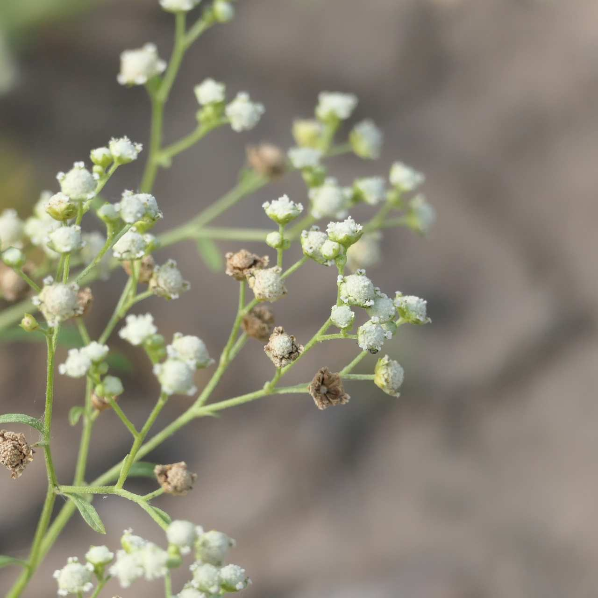
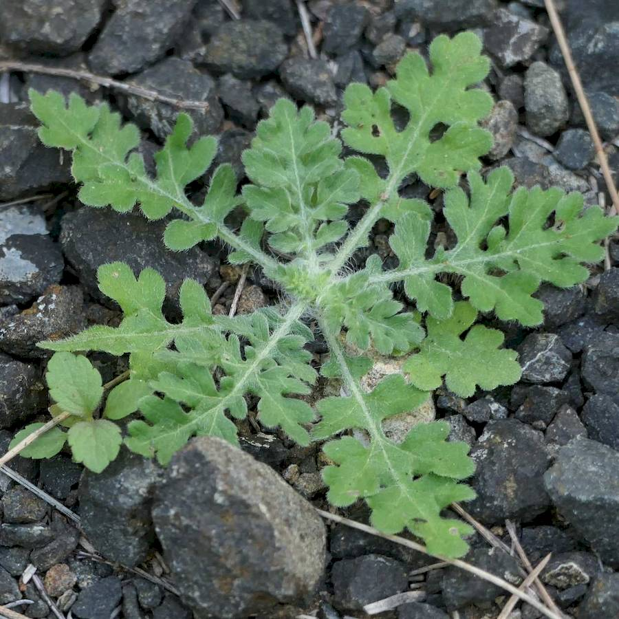
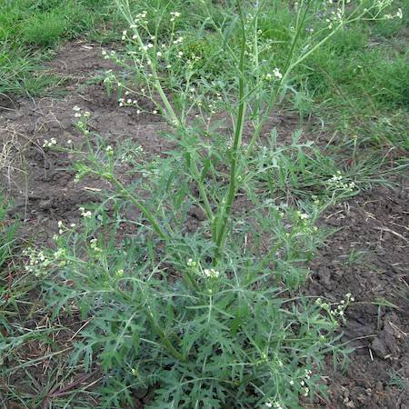

## Asteraceae
# Parthenium hysterophorus
**common names:** parthenium weed

**Plant Form** Annual rosette multi-branched herb. **Size** 50 cm to 2 m tall. **Stem** Erect and ribbed single stem, many branched above. **Leaves** Initially rosette, upper leaves deeply divided, covered in soft fine hair. **Flowers** Creamy white circular clusters. **Fruit and Seeds** Seeds tiny 1-2 mm across, triangular brown to black. **Habitat** Roadsides, paddocks, flooded areas. **Distinguishing Features** Flowers are distinctive, as are ribbed stems.

  
 *Leaf detail* 

  
 *Groved stem* 

  
 *Flowers small, five cornered and white* 

  
 *Seedling* 

  
 *Growth habit* 

