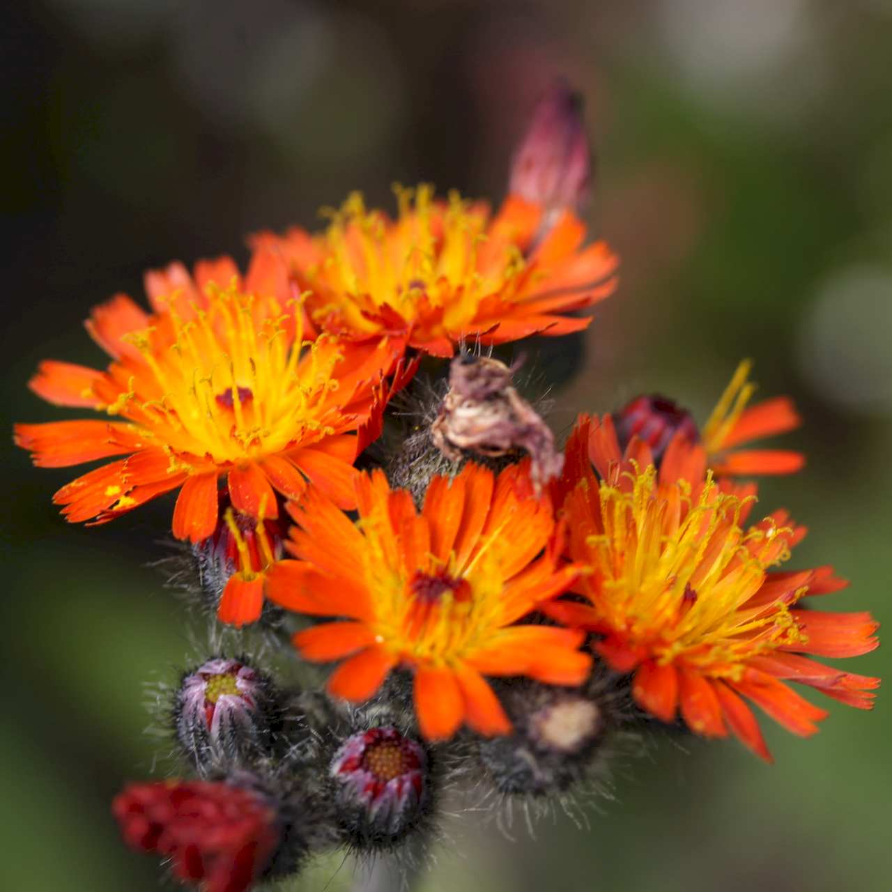
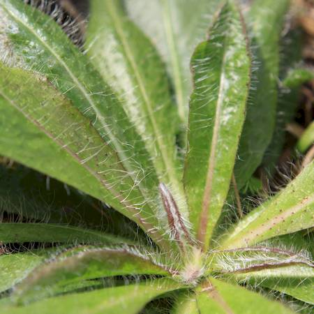
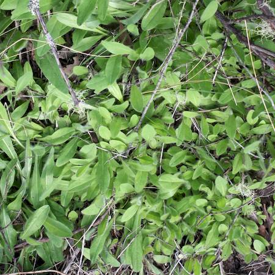
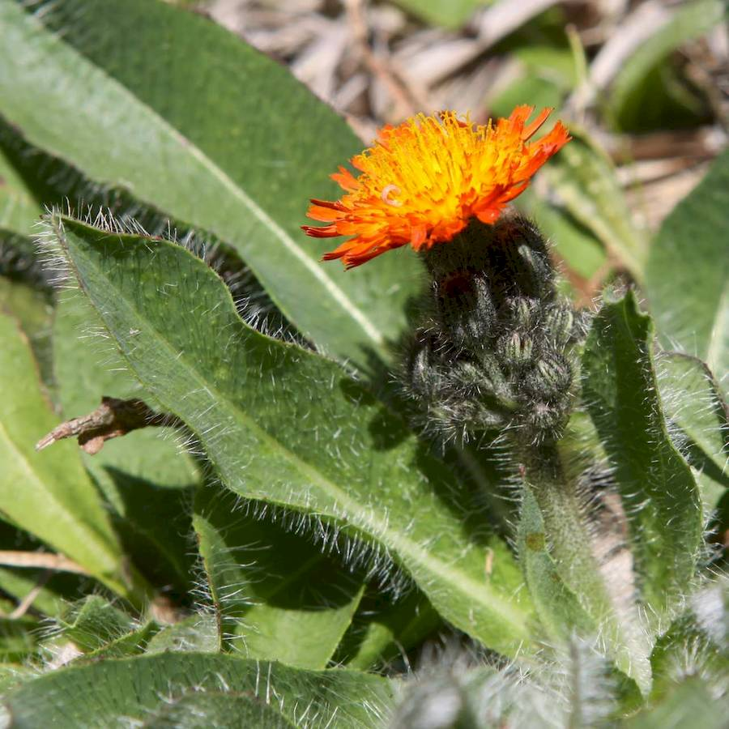
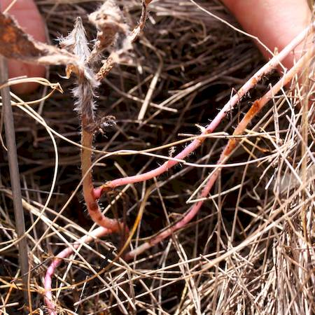

## Asteraceae
# Pilosella aurantiaca

**Plant Form** Low-growing perennial rosette herb. **Size** Up to 40cm tall. **Stem** Very short, exudes a milky sap when broken, flower stalks hairy and about 35 cm long. **Leaves** In tufts at base, about 15 cm long, slightly spear shaped, covered in fine hairs. **Flowers** Densely clustered at end of stalk 15-30 mm diameter with rows of very bright orange or reddish florets, with green bracts. **Fruit and Seeds** Narrow L-shaped about 2 mm long with parachuting hairs. **Habitat** Alpine woodlands or open heathlands, grasslands. **Distinguishing Features** Flower colour is distinctive from other hawkweeds and flatweeds.

 *Flowers are red* 

 *Leaves are hairy* 

 *Infestations spread by runners* 

 *Plant* 

 *Runners - pink stems* 

