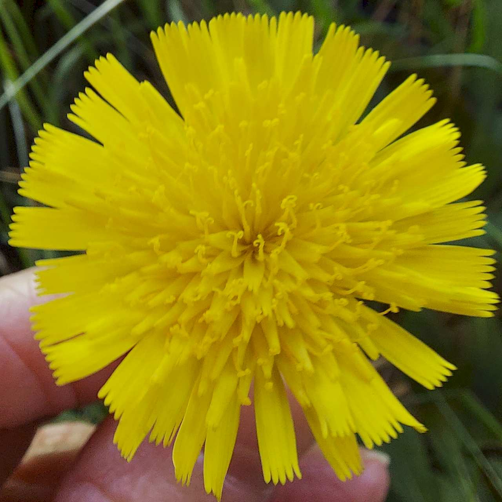
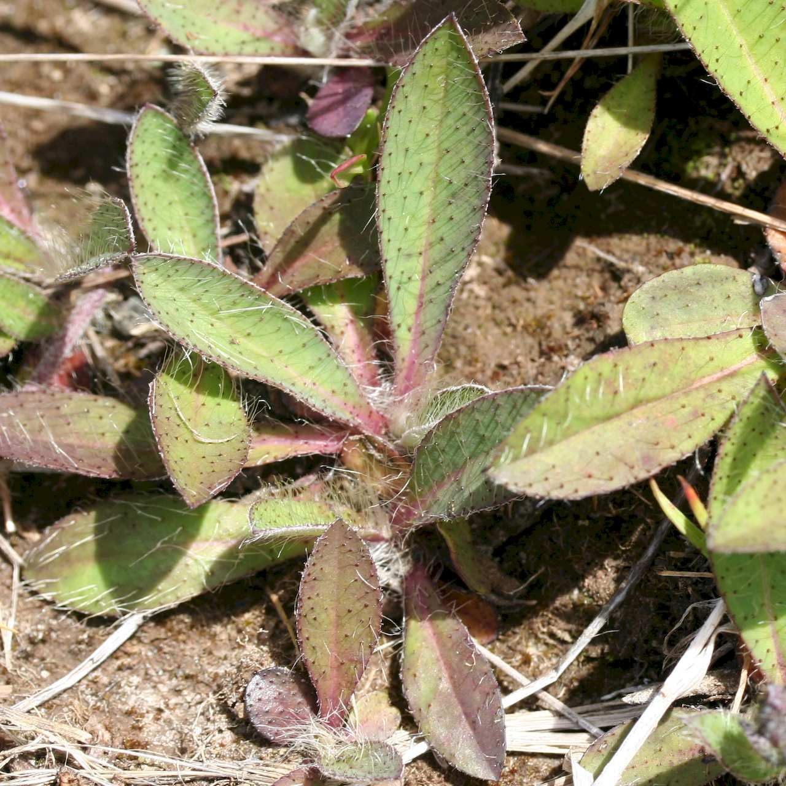
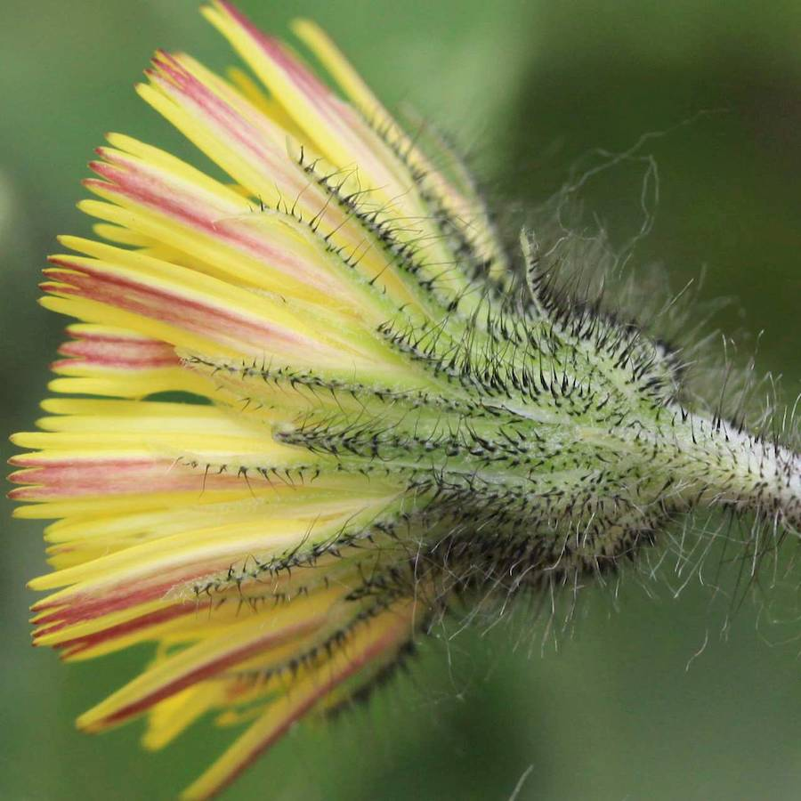
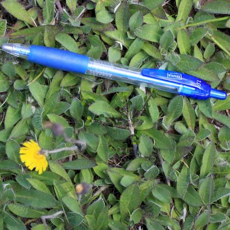

## Asteraceae
# Pilosella officinarum

**Plant Form** Low-growing perennial rosette herb. **Size** Up to 50cm tall.

 *Yellow flowers* 

 *Leaves have stiff hairs* 

 *Flower undersurface* 

 *Infestation* 

