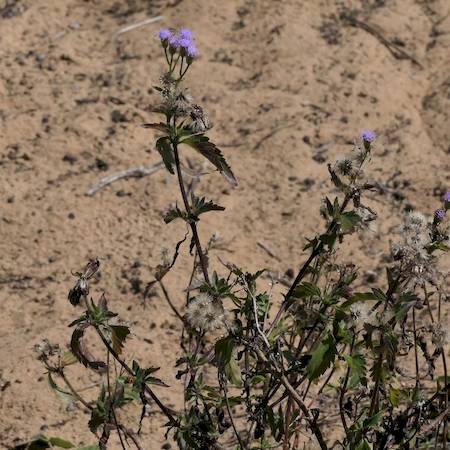
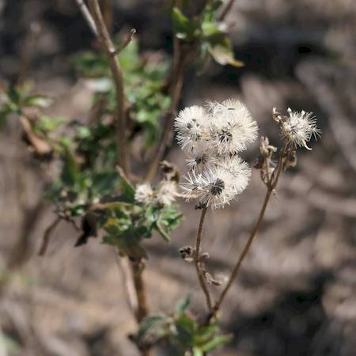

## Asteraceae
# Praxelis clematidea
**common names:** praxelis

**Plant Form** Upright annual or perennial herb. **Size** 20 cm to 1.2 m tall. **Stem** Brittle, cylindrical, covered in short soft hairs. **Leaves** Tear or oval shaped to diamond shaped, with toothed edges. **Flowers** Cone to bell shaped heads with 30-50 bluish purple florets. **Fruit and Seeds** Black seeds with tuft of white bristles. **Habitat** Roadsides, railway lines, fencelines, pastures, riverbanks, woodlands. **Distinguishing Features** When crushed, leaves smell like cat urine, hairs on Praxelis flowers tend to be longer than similar Ageratum species, leaves are more triangular.

 *Leaves are smallish and pointed* 

 *Flowers are small* 

 *Can grow in dry sand, leaves smaller dark* 

 *Wind-blown seed* 

