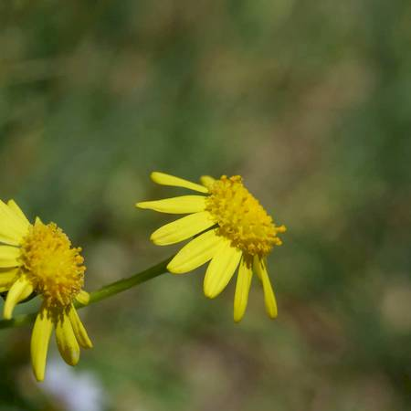
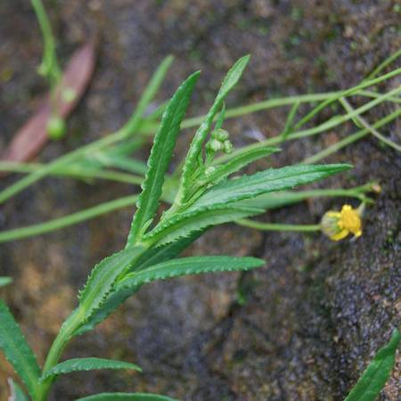
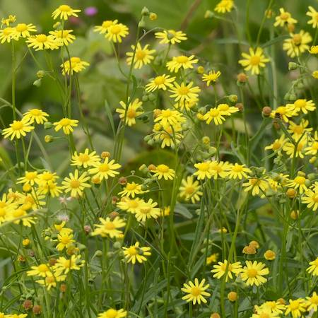

## Asteraceae
# Senecio madagascariensis
**common names:** fireweed

**Plant Form** Annual or perennial herb. **Size** 10-70 cm tall. **Stem** Thin, green, branches further up. **Leaves** Bright green, fleshy, narrow, alternate along stems, highly variable edges. **Flowers** Small, yellow, daisy-like 1-2 cm diameter. Up to 15 petals. Clusters at the end of branches. **Fruit and Seeds** Very small seeds, 1-3 mm long, cylindrical. **Habitat** Roadsides, pasture, open forest, bare ground. **Distinguishing Features** Extremely similar to several native Senecios, best way to distinguish is 13-15 petal count and fibrous root system.

 *Flowers* 

 *Leaves often deeply lobed* 

 *Often leaves without lobes* 

 *Flowers profusely* 

 *Habit* 

