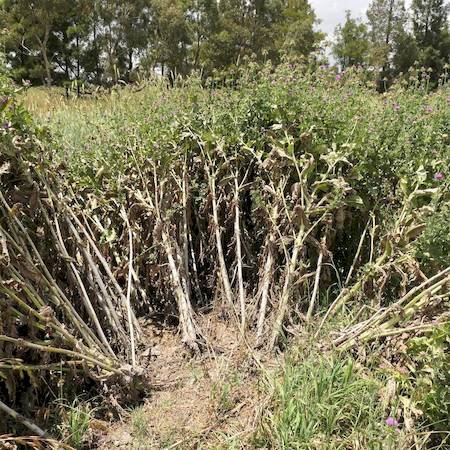

## Asteraceae
# Silybum marianum
**common names:** variegated thistle

**Plant Form** Erect annual or biennial rosette herb. **Size** 90 cm to 3 m tall. **Stem** Stout, hollow or filled with pith, ribbed, sometimes cottony. **Leaves** Shiny green with white veins and blotches (variegations) above, underneath hairy and paler, spiny on margins and over veins. Larger in rosette and more deeply lobed on stem. **Flowers** Large 3-5 cm, spiny, and at the end of long stalks, consist of numerous pink-purple tubular florets forming a head. **Fruit and Seeds** Seeds are 5-8 mm long, flattened and shiny blackish with longer barbed bristles. **Habitat** Pastures, roadsides, disturbed areas, woodlands. **Distinguishing Features** Unlikely to be confused due to variegated leaves and general shape.

  
 *Variegated leaves* 

  
 *Flower* 

  
 *Forms tall thickets* 

  
 *Infestation* 

  
 *Rosette when young* 

