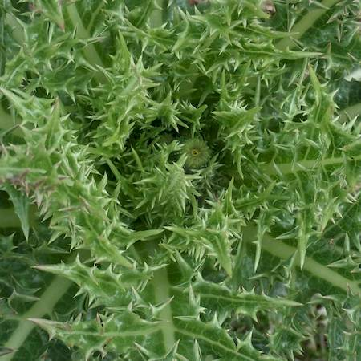
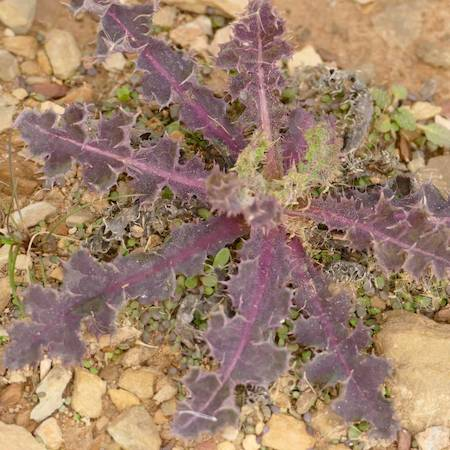
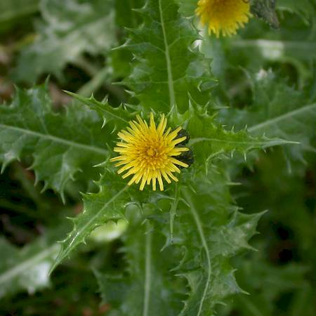

## Asteraceae
# Sonchus asper
**common names:** prickly sowthistle

**Plant Form** Annual or biennial rosette herb. **Size** 20 cm to 2 m tall.

   *Leaves prickly* 

   *Stressed growth red* 

   *Thick red stems* 

   *Flowers* 

   *Habit* 

