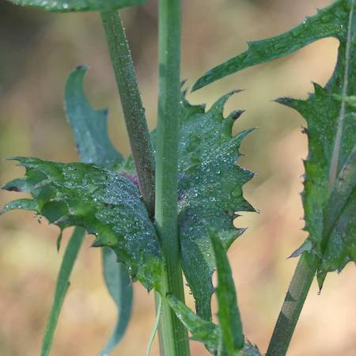
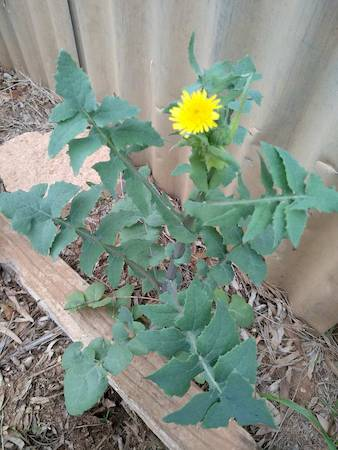

## Asteraceae
# Sonchus oleraceus
 **Plant Form** Annual rosette herb. **Size** 30cm to 1.1m tall.

 *Leaf tips* 

 *Flowers* 

 *Angular stems* 

 *Leaf based often wrap around stem* 

 *Leaves can look prickly* 

 *Habit* 

