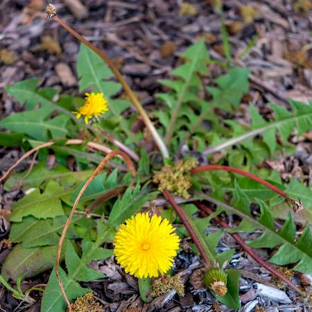

## Asteraceae
# Taraxacum officinale

**Plant Form** Perennial rosette herb. **Size** 5-40 cm tall. **Stem** Light green, slender, pithy, exudes a milky sap when cut. **Leaves** Lance shaped, often with lobes with backward pointing appearance. **Flowers** Round, bright yellow, with many straplike petals. **Fruit and Seeds** Small single-seeded capsule in globular grouping with hairy parachutes. **Habitat** Swamps, creeks, lakes, waste areas, urban bushland. **Distinguishing Features** Lance shaped leaves with backward facing lobes.

 *Leaves often saw-toothed* 

 *Flowers relatively large* 

 *Seed* 

 *One flower per stalk* 

