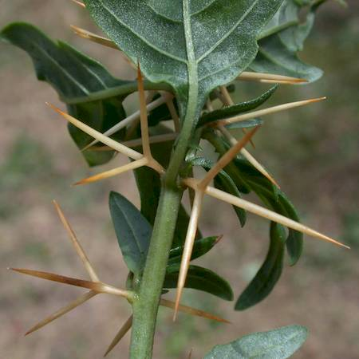
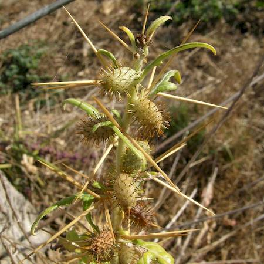

## Asteraceae
# Xanthium spinosum
 **Plant Form** Upright many-branched annual herb. **Size** 30 cm to 1 m tall. **Stem** Covered in short soft hairs, with 3 pronged spines at the base of each leaf. **Leaves** 3 or 5 lobed spear-shaped dark green with 1-3 main whitish vein, felted underneath. **Flowers** Pale green (male) or yellowish (female) surrounded by clusters of egg shaped bracts. **Fruit and Seeds** Burrs around 10 mm long with hairs and hooked spines. **Habitat** Exposed disturbed areas, grassland, woodland, water courses, rocky outcrops. **Distinguishing Features** The 3 long spines at leaf bases.

 *3-pointed spines* 

 *Thin leaves* 

 *Habit* 

 *Immature fruit* 

