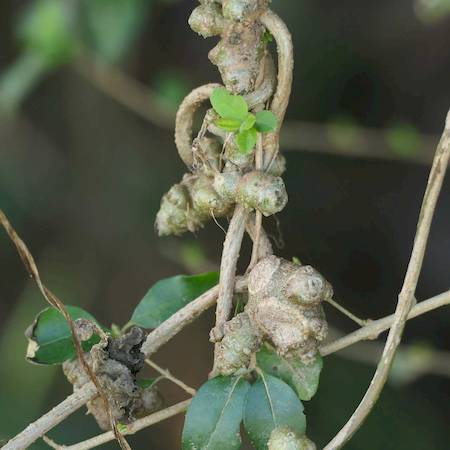

## Basellaceae
# Anredera cordifolia
 **Plant Form** Vine. **Size** Climbing to 20 m, with underground tubers to 25 cm diameter. **Stem** Green to red when young, brown when older, with tubors. **Leaves** Undivided, heart-shaped at base, 3-15 cm long, 2-10 cm wide, with stalk to 1.5 cm long. **Flowers** Star-shaped, white, up to 6 mm diameter, fragrant. **Fruit and Seeds** Rarely produces seeds in Australia. **Habitat** Along coastal areas in subtropical and temperate areas, but increasingly found further inland. **Distinguishing Features** Potato-like aerial tubors at the nodes.

 *Glossy leaves* 

 *Spent flower spikes* 

 *Aerial tubers on vine stems* 

