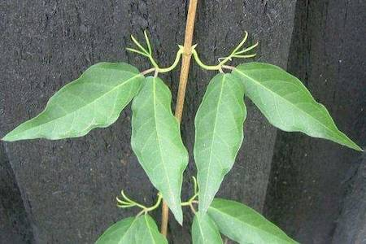

## Bignoniaceae
# Dolichandra unguis-cati
**common names:** cat's claw creeper

**Plant Form** Woody climber. **Size** Climbs up to 30 m high. **Stem** Young stems green and hairless, progressing to woody and up to 15 cm thick at maturity. **Leaves** Claw shaped 3-17 mm long, oppositely arranged and hairless with pointed tips. **Flowers** Bright yellow tubular flowers, often with fine reddish lines inside. **Fruit and Seeds** Long glossy green, strap like capsules 15-50 cm long, with numerous papery seeds. **Habitat** Along waterways, and in disturbed rainforest and roadsides. **Distinguishing Features** Claw-like tendrils and showy flowers.

  
 *Stem climbing vine* 

  
 *Flower* 

  
 *Cats claws (QLD Deedi)* 

