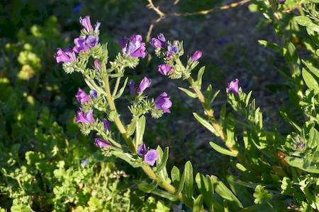

## Boraginaceae
# Echium plantagineum
 **Plant Form** Erect annual herb. **Size** Up to 1.5 m tall. **Stem** Several green hairy erect flowering stems per plant. **Leaves** Egg shaped hairy up to 30 cm long in rosette at base, stem leaves smaller and narrower, also hairy. **Flowers** Usually purple, but also blue or white. 2-3 cm long. Trumpet shaped with 5 stamens, 2 of which protrude out of flower. **Fruit and Seeds** Dark brown or grey with roughened coat. Up to 4 per flower. **Habitat** Wide habitat tolerance, can grow almost anywhere in Australia. Prefers winter-rainfall areas. Roadsides and agricultural areas. **Distinguishing Features** Distinguished from Echium vulgare by fewer stamens protruding outside flower.

 *Flower* 

 *White-flowering form* 

 *Juvenile form* 

 *Flowers unroll (cymes)* 

 *Leaves become bunchy in summer* 

 *Late season flowers* 

 *Infestation* 

