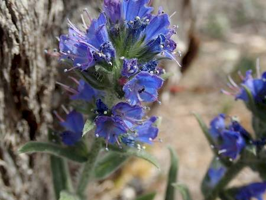
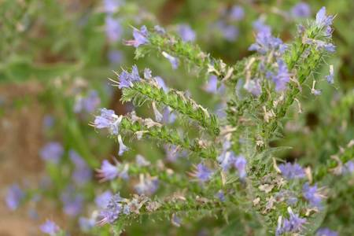

## Boraginaceae
# Echium vulgare

**Plant Form** Upright biennial herb. **Size** Up to 1.2 m tall. **Stem** Erect. **Leaves** Rosette leaves spear shaped. Stem leaves narrow. **Flowers** 1-2 cm long, blue to purple. 4-5 stamens beyond end of flower. **Fruit and Seeds** Brown or grey, pyramid shaped, rough. **Habitat** Prefers winter rainfall areas. Roadsides and agricultural land. **Distinguishing Features** More warty appearance than Echium plantagineum and more stamens protruding beyond flower.

  
 *Blue flowers* 

  
 *Early rosette leaves* 

  
 *Flower close-up* 

  
 *Flowers and stems* 

  
 *Flower on old plant* 

