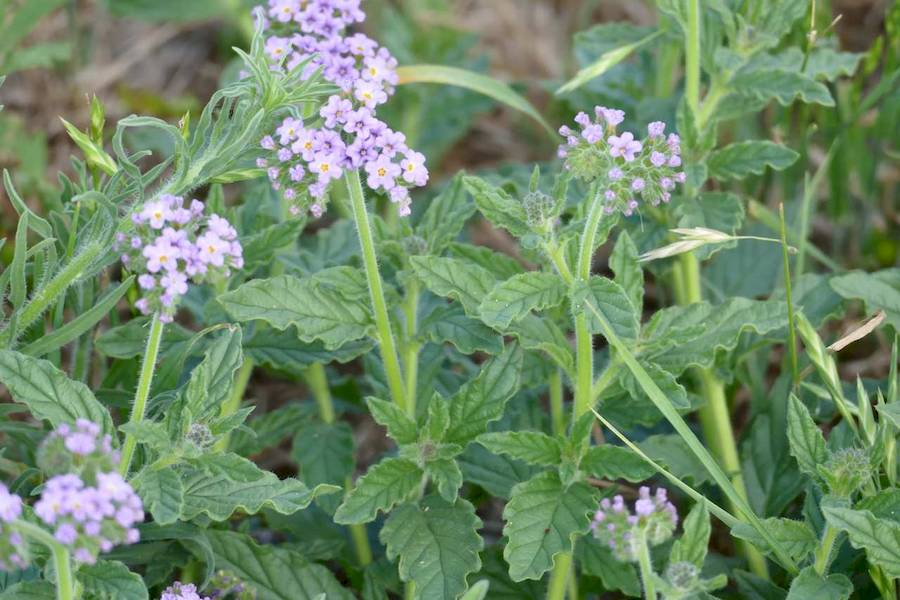
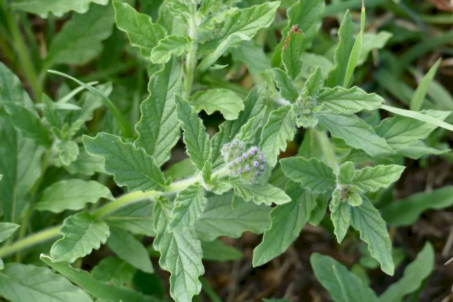
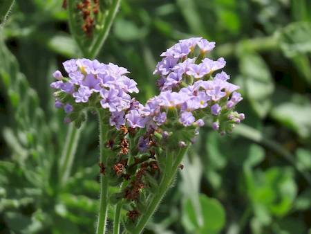

## Boraginaceae
# Heliotropium amplexicaule
**common names:** blue heliotrope

**Plant Form** Perennial creeping herb. **Size** Up to 30cm tall. **Stem** Woody rootstock, hairy stems branching out. **Leaves** Alternate along stems, up to 9 cm long, dull green, soft and hairy, taper at both ends. **Flowers** Small, tubular, pink to blue with yellow centre, arranged on a coiled spike. **Fruit and Seeds** Two dark brown, wrinkled nutlets. **Habitat** Pastures, crops, roadsides, disturbed areas, riverbanks. **Distinguishing Features** Distinguished from other heliotropes by tapered leaves and glandular hairs.

   *Growth habit* 

   *Leaves are wavy* 

   *Flowers unroll* 

